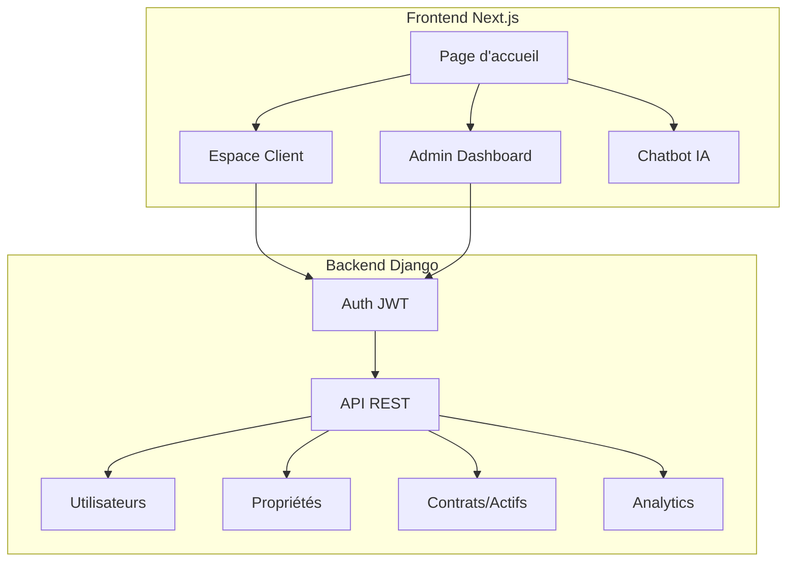

# Fusion des Projets: sunset-plaza + your-friendly-hub

Modernisation de **sunset-plaza** avec les meilleures fonctionnalités de **your-friendly-hub**.

## Décisions Confirmées

| Aspect | Choix |
|--------|-------|
| Backend | **Django** (conservé) |
| Langue | **Multi-langue** (FR par défaut, auto-détection, switcher) |
| Priorité | Sécurité + Design luxueux + Responsive |
| Création de comptes | Admin crée les comptes clients (plus sécurisé) |

---

## Architecture Proposée



---

## Phase 1: Fondation Frontend (TypeScript + shadcn/ui)

#### Dépendances à ajouter
```json
{
  "typescript": "^5.8",
  "@tanstack/react-query": "^5.83",
  "react-hook-form": "^7.61",
  "zod": "^3.25",
  "lucide-react": "^0.462",
  "framer-motion": "^11",
  "class-variance-authority": "^0.7",
  "clsx": "^2.1",
  "tailwind-merge": "^2.6",
  "sonner": "^1.7",
  "next-themes": "^0.3",
  "next-intl": "^3.25"
}
```

#### Fichiers de configuration
- `tsconfig.json` - Configuration TypeScript
- `components.json` - Configuration shadcn/ui
- `tailwind.config.js` - Thème luxueux avec animations

---

## Phase 2: Internationalisation (i18n)

> **Mécanisme**: Auto-détection → localStorage → Dropdown switcher

#### Fonctionnement
1. **Premier accès**: Détection langue navigateur (`navigator.language`)
2. **Préférence sauvée**: `localStorage.setItem('locale', 'fr')`
3. **Switcher**: Dropdown dans Navbar (FR 🇫🇷 / EN 🇬🇧 / AR 🇲🇦)
4. **Persistence**: Préférence conservée entre sessions

#### Structure des traductions
```
frontend/
├── messages/
│   ├── fr.json    # Français (défaut)
│   ├── en.json    # English
│   └── ar.json    # العربية
├── i18n.ts        # Configuration next-intl
└── middleware.ts  # Détection automatique
```

#### Exemple `messages/fr.json`
```json
{
  "nav": { 
    "home": "Accueil", 
    "spaces": "Espaces", 
    "contact": "Contact",
    "login": "Connexion"
  },
  "hero": { 
    "title": "Votre futur espace de travail à Sunset Plaza", 
    "subtitle": "Espaces de bureaux modernes et prestigieux à Casablanca",
    "cta": "Explorer nos espaces" 
  },
  "contact": { 
    "name": "Nom complet", 
    "email": "Adresse email", 
    "phone": "Téléphone",
    "message": "Votre message",
    "submit": "Envoyer la demande" 
  }
}
```

---

## Phase 3: Design Premium & Responsive

### Palette de Couleurs
| Couleur | Hex | Usage |
|---------|-----|-------|
| Or/Ambre | `#f59e0b` | Accents, CTAs, hover |
| Noir profond | `#0f172a` | Texte principal, headers |
| Blanc cassé | `#f7f3ef` | Arrière-plans |
| Gris slate | `#64748b` | Texte secondaire |

### Typographie
- **Titres**: Playfair Display (serif, élégant)
- **Corps**: Inter (sans-serif, lisible)

### Effets visuels
- Glassmorphism (backdrop-blur)
- Ombres élégantes (shadow-lg avec opacité réduite)
- Micro-animations Framer Motion
- Transitions fluides (300ms ease-out)

### Breakpoints Responsive
| Device | Largeur | Adaptations |
|--------|---------|-------------|
| Mobile | 375px+ | Menu hamburger, grille 1 colonne |
| Tablette | 768px+ | Grille 2 colonnes, menu compact |
| Desktop | 1024px+ | Navigation complète, grille 3 colonnes |
| Large | 1440px+ | Conteneur max-width, espacement accru |

---

## Phase 4: Composants UI Luxueux

| Composant | Description | Fichier |
|-----------|-------------|---------|
| Navbar | Navigation responsive + Language Switcher + Auth | `components/Navbar.tsx` |
| HeroSection | Section d'accueil animée avec stats | `components/HeroSection.tsx` |
| SpacesSection | Grille de propriétés avec filtres | `components/SpacesSection.tsx` |
| SpaceCard | Carte propriété avec image, prix, surface | `components/SpaceCard.tsx` |
| AdvantagesSection | Avantages en cartes avec icônes | `components/AdvantagesSection.tsx` |
| ContactSection | Formulaire avec validation Zod | `components/ContactSection.tsx` |
| ChatWidget | Chatbot IA avec historique | `components/ChatWidget.tsx` |
| Footer | Pied de page multilingue | `components/Footer.tsx` |

---

## Phase 5: Espace Client (Portail Propriétaire)

> **Flux**: L'admin crée le compte client → envoie les identifiants → le client accède à son espace.

### Backend Django - App `assets`

```python
# apps/assets/models.py

class ClientAsset(models.Model):
    """Propriété appartenant à un client"""
    client = models.ForeignKey(Visitor, on_delete=models.CASCADE, related_name="assets")
    property = models.ForeignKey(SiteContent, on_delete=models.CASCADE)
    
    # Infos du contrat
    purchase_date = models.DateField()
    purchase_price = models.DecimalField(max_digits=12, decimal_places=2)
    contract_type = models.CharField(max_length=20, choices=[
        ("BUY", "Achat"),
        ("RENT", "Location"),
        ("INVEST", "Investissement")
    ])
    
    # État actuel
    status = models.CharField(max_length=30, choices=[
        ("ACTIVE", "Actif"),
        ("PENDING", "En cours de finalisation"),
        ("SOLD", "Vendu"),
        ("UNDER_RENOVATION", "En rénovation")
    ])
    current_value = models.DecimalField(max_digits=12, decimal_places=2, null=True)
    monthly_income = models.DecimalField(max_digits=10, decimal_places=2, null=True)
    
    # Documents
    contract_document = models.FileField(upload_to="contracts/", null=True)
    
    created_at = models.DateTimeField(auto_now_add=True)
    updated_at = models.DateTimeField(auto_now=True)
    
    class Meta:
        verbose_name = "Actif Client"
        verbose_name_plural = "Actifs Clients"
```

### Frontend - Dashboard Client `/client`

| Section | Contenu |
|---------|---------|
| **Mes Propriétés** | Liste des actifs avec état, valeur, localisation |
| **Performance** | Graphiques de rendement (ROI, revenus mensuels) |
| **Documents** | Téléchargement contrats, factures, attestations |
| **Notifications** | Alertes sur changements d'état, échéances |
| **Contact Direct** | Messagerie avec gestionnaire assigné |

---

## Phase 6: Admin Dashboard Professionnel

> **Objectif**: Données réelles et utiles, interface impressionnante.

### Métriques en Temps Réel

| KPI | Calcul | Icône |
|-----|--------|-------|
| Revenu mensuel | Σ loyers + revenus investissement | 💰 |
| Taux d'occupation | Propriétés louées / Total × 100 | 📊 |
| Valeur portefeuille | Σ valeurs actuelles propriétés | 🏢 |
| Prospects en attente | COUNT(demandes status=PENDING) | 📋 |
| Visites cette semaine | COUNT(visites date >= today) | 📅 |

### Onglets de Gestion

| Onglet | Fonctionnalités |
|--------|-----------------|
| **Vue d'ensemble** | Dashboard avec KPIs, graphiques tendances, alertes |
| **Demandes** | Tableau filtrable, assignation, changement statut |
| **Propriétés** | CRUD complet, upload images, modification prix |
| **Clients** | Création comptes, gestion actifs, historique |
| **Visites** | Calendrier interactif, confirmations, rappels |
| **Analytics** | Graphiques Recharts (revenus, conversions, sources) |

### API Analytics Backend

```python
# apps/content/views.py

class DashboardAnalyticsView(APIView):
    permission_classes = [IsAdminUser]
    
    def get(self, request):
        return Response({
            "total_revenue": self.calculate_monthly_revenue(),
            "occupancy_rate": self.calculate_occupancy_rate(),
            "portfolio_value": self.calculate_portfolio_value(),
            "pending_requests": ContactRequest.objects.filter(status="PENDING").count(),
            "weekly_visits": VisitRequest.objects.filter(
                preferred_date__gte=timezone.now().date()
            ).count(),
            "revenue_chart": self.get_revenue_chart_data(),
            "properties_by_type": self.get_properties_breakdown(),
            "top_performers": self.get_top_performing_assets(),
        })
```

---

## Phase 7: Sécurité Renforcée

### Backend
- ✅ Permissions par rôle (Admin/Client/Visiteur)
- ✅ Rate limiting (throttling DRF)
- ✅ Audit logs pour actions sensibles
- ✅ JWT avec refresh tokens (expiration courte)
- ✅ Validation stricte des entrées

### Frontend
- ✅ Routes protégées avec middleware
- ✅ Tokens stockés en httpOnly cookies (pas localStorage)
- ✅ CSRF protection
- ✅ Content Security Policy headers

---

## Phase 8: Chat Persistant & Amélioré

### Modèles Django

```python
# apps/chatbot/models.py

class ChatConversation(models.Model):
    visitor_id = models.CharField(max_length=100)  # Cookie session ID
    visitor = models.ForeignKey(Visitor, null=True, blank=True, on_delete=models.SET_NULL)
    created_at = models.DateTimeField(auto_now_add=True)
    updated_at = models.DateTimeField(auto_now=True)
    
    class Meta:
        ordering = ['-updated_at']

class ChatMessage(models.Model):
    conversation = models.ForeignKey(ChatConversation, on_delete=models.CASCADE, related_name="messages")
    role = models.CharField(max_length=20, choices=[
        ("user", "Utilisateur"),
        ("assistant", "Assistant IA")
    ])
    content = models.TextField()
    created_at = models.DateTimeField(auto_now_add=True)
    
    class Meta:
        ordering = ['created_at']
```

---

## Structure Finale du Projet

```
sunset-plaza/
├── backend/
│   ├── apps/
│   │   ├── users/          # Auth + Profils
│   │   ├── content/        # Propriétés + News + Analytics
│   │   ├── contacts/       # Demandes de contact
│   │   ├── chatbot/        # IA Gemini + Messages persistants
│   │   ├── assets/         # [NEW] Actifs clients
│   │   └── visits/         # [NEW] Planification visites
│   └── config/
│
├── frontend/
│   ├── app/
│   │   ├── page.tsx            # Accueil
│   │   ├── [locale]/           # Routes i18n
│   │   ├── client/page.tsx     # [NEW] Espace client
│   │   ├── admin/page.tsx      # [NEW] Dashboard admin
│   │   └── auth/page.tsx       # [NEW] Login/Register
│   ├── components/
│   │   ├── ui/                 # shadcn/ui components
│   │   ├── Navbar.tsx
│   │   ├── HeroSection.tsx
│   │   └── ...
│   ├── messages/               # [NEW] Traductions
│   │   ├── fr.json
│   │   ├── en.json
│   │   └── ar.json
│   ├── hooks/
│   │   ├── useAuth.ts
│   │   └── useContent.ts
│   └── lib/
│       ├── utils.ts
│       └── queryClient.ts
│
└── docs/
    └── IMPLEMENTATION_PLAN.md  # Ce fichier
```

---

## Ordre d'Implémentation

| Phase | Description | Priorité |
|-------|-------------|----------|
| 1-2 | Foundation TypeScript + i18n | 🔴 Critique |
| 3 | Design system luxueux | 🔴 Critique |
| 4 | Composants UI responsive | 🔴 Critique |
| 6 | Admin Dashboard | 🟡 Haute |
| 5 | Espace Client | 🟡 Haute |
| 7 | Sécurité renforcée | 🟢 Moyenne |
| 8 | Chat persistant | 🟢 Moyenne |
