# 🌅 Sunset Plaza - Complete Project Analysis

> **Project**: Premium Real Estate Management System  
> **Stack**: Django 6.0 + Next.js 16 + Gemini AI  
> **Analysis Date**: February 2026

---

## 📑 Table of Contents

1. [Executive Summary](#executive-summary)
2. [Architecture Overview](#architecture-overview)
3. [Technology Stack Analysis](#technology-stack-analysis)
4. [Database Schema & Class Diagram](#database-schema--class-diagram)
5. [Component Diagram](#component-diagram)
6. [Use Case Diagrams](#use-case-diagrams)
7. [Sequence Diagrams](#sequence-diagrams)
8. [API Endpoints Analysis](#api-endpoints-analysis)
9. [Frontend Architecture](#frontend-architecture)
10. [AI & Translation Features](#ai--translation-features)
11. [Security Analysis](#security-analysis)
12. [Key Insights & Recommendations](#key-insights--recommendations)

---

## Executive Summary

**Sunset Plaza** is an AI-driven real estate platform that combines:

- **Django REST Framework** backend for robust API handling
- **Next.js 16** frontend with App Router for modern SSR/SSG
- **Google Gemini AI** for intelligent sales chatbot
- **DeepL + Google Translate** for multilingual content (FR, EN, AR)
- **Analytics system** with geolocation tracking

The platform targets premium office space listings with a focus on investment conversion through AI-powered sales conversations.

---

## Architecture Overview

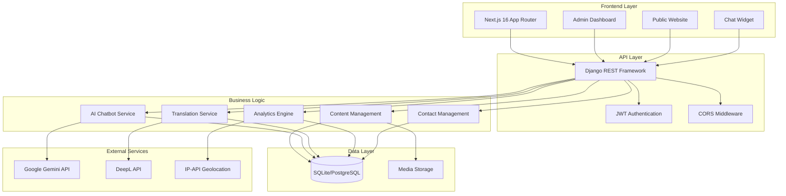

---

## Technology Stack Analysis

### Backend Infrastructure

| Component | Technology | Version | Purpose |
|-----------|------------|---------|---------|
| **Core Framework** | Django | 6.0 | High-level Python web framework |
| **API Layer** | Django REST Framework | Latest | RESTful API toolkit |
| **Database** | SQLite (dev) / PostgreSQL (prod) | - | Relational data storage |
| **Authentication** | SimpleJWT | - | JSON Web Token auth |
| **AI Engine** | Google Generative AI | - | Gemini chatbot integration |
| **i18n** | Django-Modeltranslation | - | Database-level translations |
| **Translation** | DeepL + Deep-Translator | - | Auto-translation services |

### Frontend Application

| Component | Technology | Version | Purpose |
|-----------|------------|---------|---------|
| **Framework** | Next.js | 16 | React meta-framework |
| **UI Library** | React | 19 | Component library |
| **Language** | TypeScript | - | Type safety |
| **Styling** | Tailwind CSS | v4 | Utility-first CSS |
| **Animation** | Framer Motion | - | Motion library |
| **Components** | Radix UI | - | Accessible primitives |
| **State** | TanStack Query | - | Async state management |
| **HTTP** | Axios | - | API client |

---

## Database Schema & Class Diagram

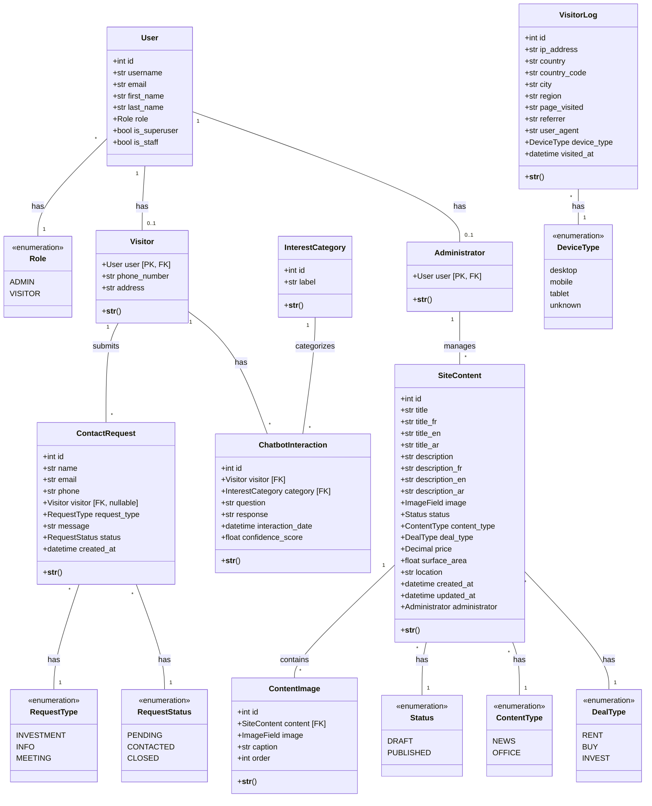

---

## Component Diagram

```mermaid
flowchart TB
    subgraph "Next.js Frontend"
        subgraph "Public Pages"
            PP1["/(locale)/page.tsx<br>Landing Page"]
            PP2["HeroSection.tsx"]
            PP3["SpacesSection.tsx"]
            PP4["ContactSection.tsx"]
            PP5["Footer.tsx"]
            PP6["ChatWidget.tsx"]
        end
        
        subgraph "Admin Dashboard"
            AD1["admin/page.tsx<br>Dashboard Overview"]
            AD2["admin/listings/"]
            AD3["admin/chatbot/"]
            AD4["admin/messages/"]
            AD5["admin/analytics/"]
            AD6["admin/settings/"]
        end
        
        subgraph "Shared"
            SH1["Navbar.tsx"]
            SH2["LanguageSwitcher.tsx"]
            SH3["ui/ Components"]
        end
        
        subgraph "Services"
            API["lib/api.ts"]
            I18N["lib/i18n.tsx"]
        end
    end
    
    subgraph "Django Backend"
        subgraph "apps.users"
            U1["User Model"]
            U2["Visitor Model"]
            U3["Administrator Model"]
            U4["JWT Views"]
        end
        
        subgraph "apps.content"
            C1["SiteContent Model"]
            C2["ContentImage Model"]
            C3["Translation Config"]
            C4["CRUD Views"]
            C5["Auto-Translate View"]
        end
        
        subgraph "apps.chatbot"
            CB1["ChatbotInteraction Model"]
            CB2["InterestCategory Model"]
            CB3["GeminiService"]
            CB4["ChatbotView"]
        end
        
        subgraph "apps.contacts"
            CT1["ContactRequest Model"]
            CT2["Submit View"]
            CT3["Admin Views"]
        end
        
        subgraph "apps.analytics"
            AN1["VisitorLog Model"]
            AN2["Track View"]
            AN3["Dashboard APIs"]
        end
    end
    
    PP1 --> PP2
    PP1 --> PP3
    PP1 --> PP4
    PP1 --> PP5
    PP1 --> PP6
    
    API --> U4
    API --> C4
    API --> CB4
    API --> CT2
    API --> AN2
```

---

## Use Case Diagrams

### Visitor Use Cases

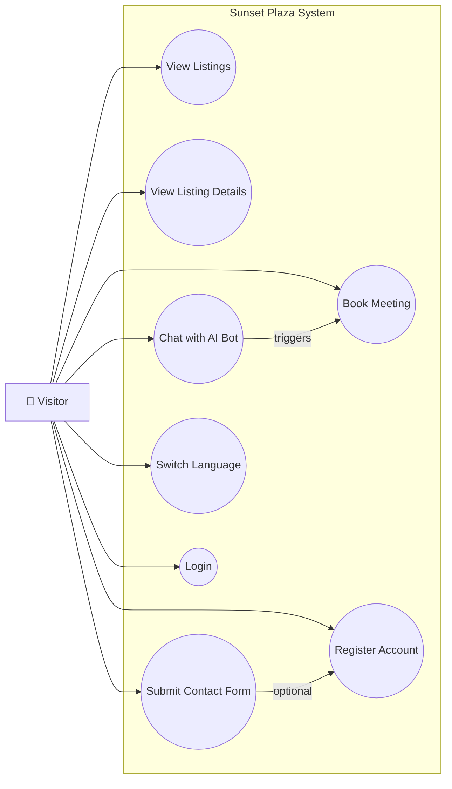

### Administrator Use Cases

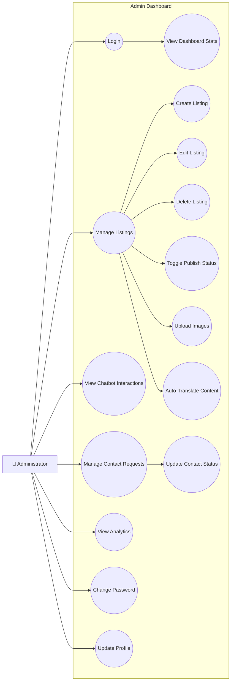

### System Actor Use Cases

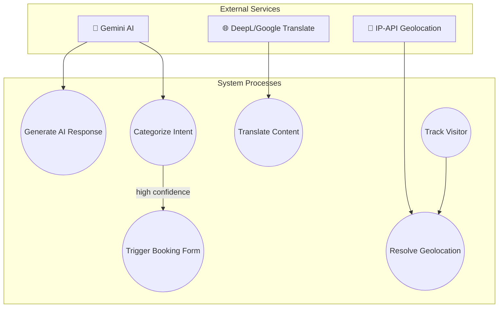

---

## Sequence Diagrams

### 1. AI Chatbot Interaction Flow

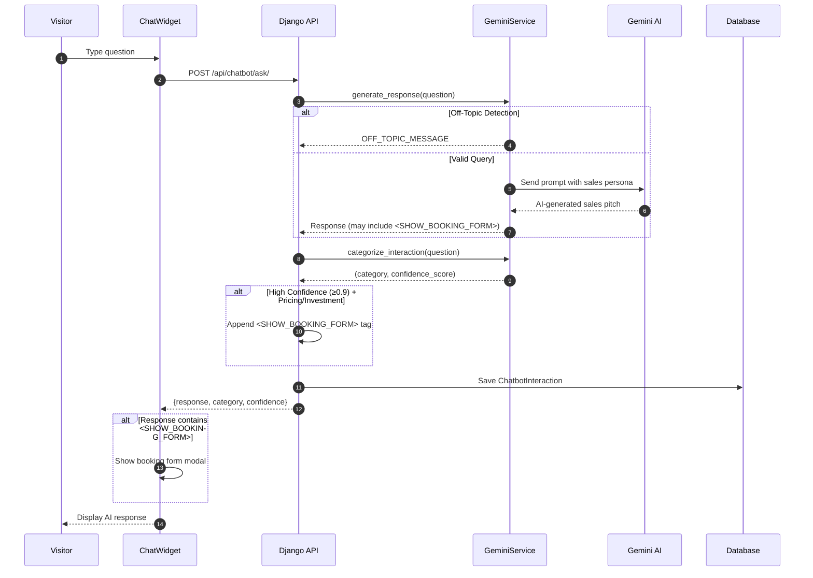

### 2. Contact Form Submission Flow

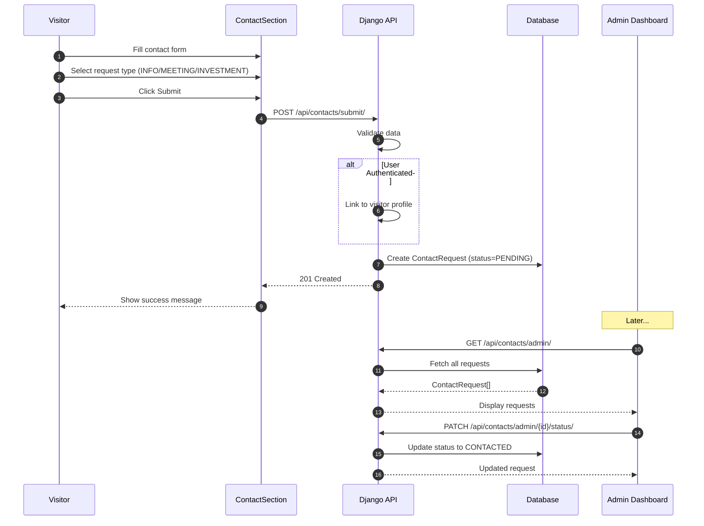

### 3. Content Auto-Translation Flow

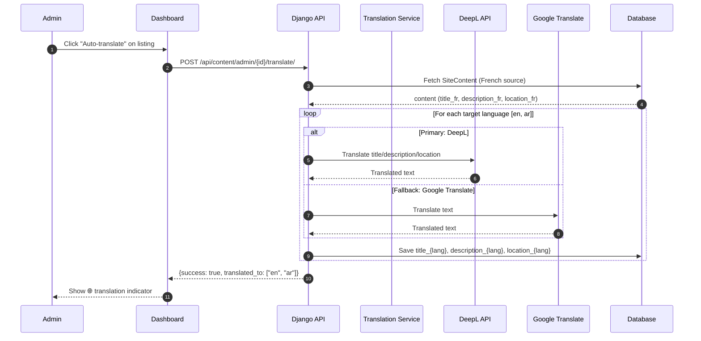

### 4. Visitor Analytics Tracking Flow

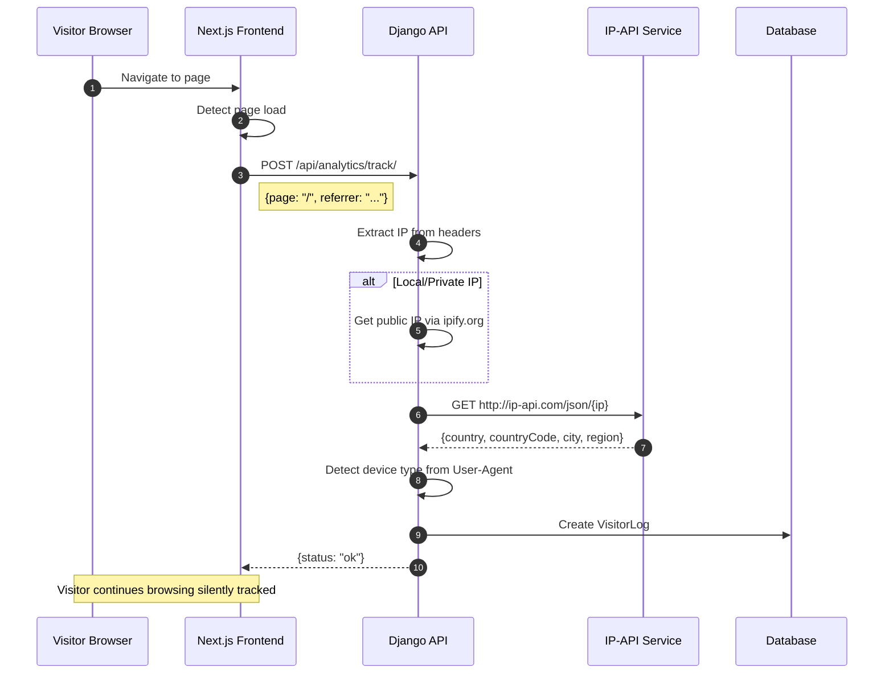

### 5. User Authentication Flow

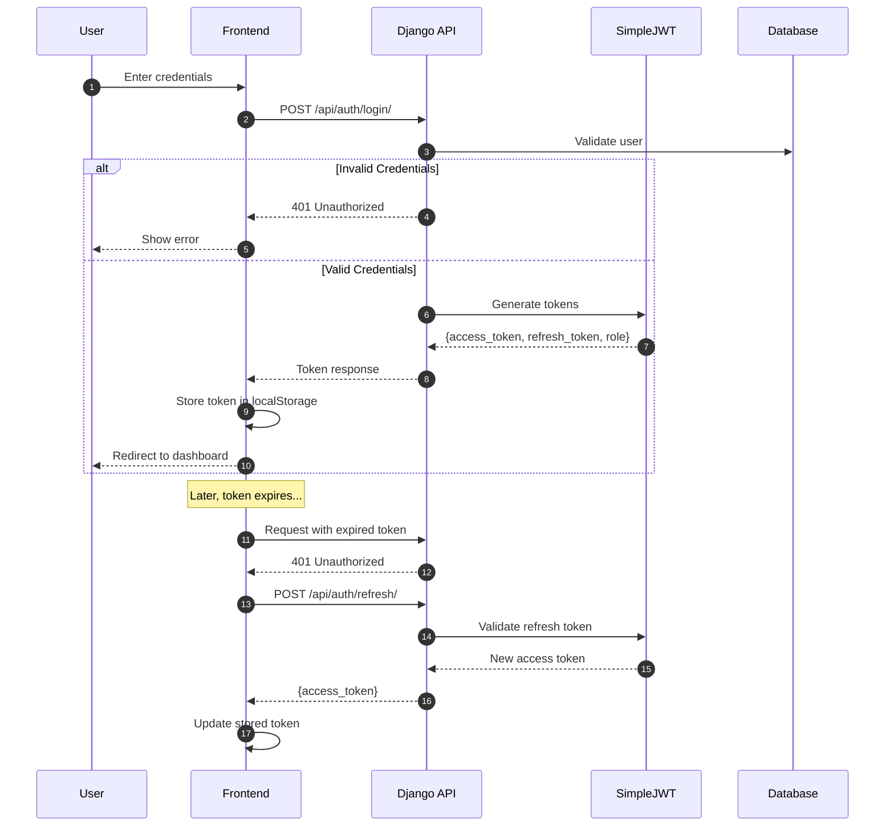

### 6. Listing CRUD Operations Flow

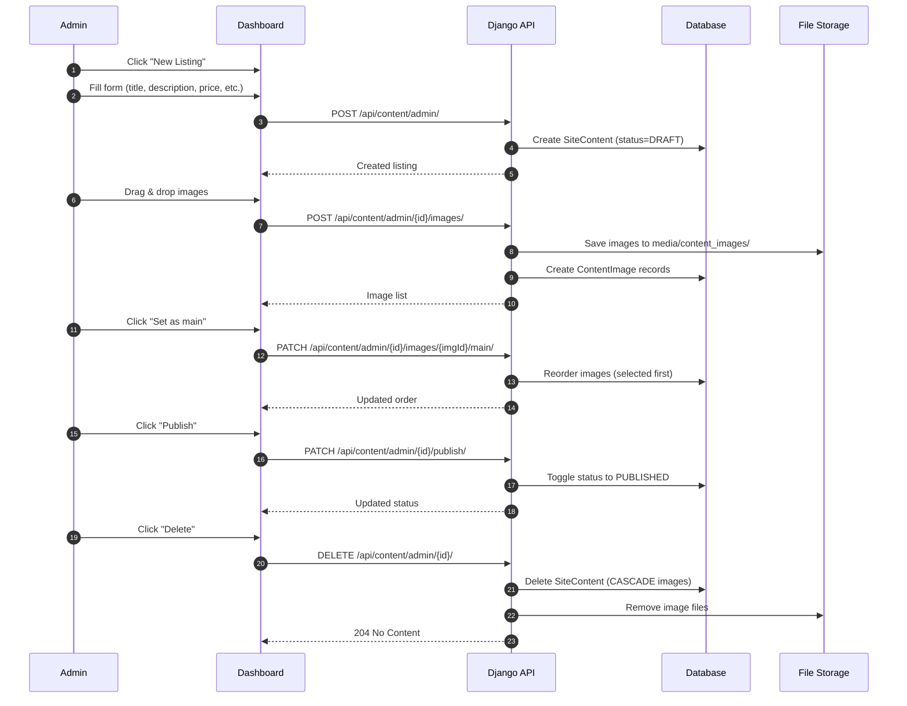

---

## API Endpoints Analysis

### Authentication (`/api/auth/`)

| Method | Endpoint | Description | Auth |
|--------|----------|-------------|------|
| POST | `/login/` | Obtain JWT tokens | ❌ |
| POST | `/refresh/` | Refresh access token | ❌ |
| POST | `/register/` | Register new visitor | ❌ |
| GET/PATCH | `/me/` | Get/Update user profile | ✅ |
| GET/PATCH | `/admin/profile/` | Get/Update admin profile | ✅ |
| POST | `/admin/password/` | Change password | ✅ |

### Content (`/api/content/`)

| Method | Endpoint | Description | Auth |
|--------|----------|-------------|------|
| GET | `/` | List published content | ❌ |
| GET | `/{id}/` | Get single published content | ❌ |
| GET/POST | `/admin/` | List all / Create content | ⚠️ |
| GET | `/admin/stats/` | Dashboard statistics | ⚠️ |
| GET/PUT/DELETE | `/admin/{id}/` | CRUD single content | ⚠️ |
| PATCH | `/admin/{id}/publish/` | Toggle publish status | ⚠️ |
| POST | `/admin/{id}/translate/` | Auto-translate to all langs | ⚠️ |
| GET/POST | `/admin/{id}/images/` | List/Upload images | ⚠️ |
| DELETE | `/admin/{id}/images/{imgId}/` | Delete image | ⚠️ |
| PATCH | `/admin/{id}/images/reorder/` | Reorder images | ⚠️ |
| PATCH | `/admin/{id}/images/{imgId}/main/` | Set main image | ⚠️ |

### Chatbot (`/api/chatbot/`)

| Method | Endpoint | Description | Auth |
|--------|----------|-------------|------|
| POST | `/ask/` | Send question to AI | ❌ |
| GET | `/admin/` | List all interactions | ⚠️ |
| GET | `/admin/stats/` | Chatbot statistics | ⚠️ |
| DELETE | `/admin/{id}/` | Delete interaction | ⚠️ |

### Contacts (`/api/contacts/`)

| Method | Endpoint | Description | Auth |
|--------|----------|-------------|------|
| POST | `/submit/` | Submit contact form | ❌ |
| GET | `/admin/` | List all requests | ⚠️ |
| GET/PUT/DELETE | `/admin/{id}/` | CRUD request | ⚠️ |
| PATCH | `/admin/{id}/status/` | Quick status update | ⚠️ |
| GET | `/admin/stats/` | Contact statistics | ⚠️ |

### Analytics (`/api/analytics/`)

| Method | Endpoint | Description | Auth |
|--------|----------|-------------|------|
| POST | `/track/` | Track visitor (silent) | ❌ |
| GET | `/dashboard/` | Summary statistics | ⚠️ |
| GET | `/traffic/` | Daily traffic data | ⚠️ |
| GET | `/devices/` | Device breakdown | ⚠️ |
| GET | `/countries/` | Top countries | ⚠️ |
| GET | `/recent/` | Recent visitors | ⚠️ |

> **Legend**: ✅ = Required | ⚠️ = Currently AllowAny (TODO: secure) | ❌ = Public

---

## Frontend Architecture

### Page Structure

```
frontend/
├── app/
│   ├── [locale]/                  # Internationalized routes
│   │   ├── layout.tsx             # Locale provider wrapper
│   │   └── page.tsx               # Public landing page
│   ├── admin/
│   │   ├── layout.tsx             # Admin layout with sidebar
│   │   ├── page.tsx               # Dashboard overview
│   │   ├── analytics/page.tsx     # Analytics dashboard
│   │   ├── chatbot/page.tsx       # Chatbot interactions
│   │   ├── listings/page.tsx      # Content management
│   │   ├── messages/page.tsx      # Contact requests
│   │   ├── settings/page.tsx      # Profile & security
│   │   └── login/page.tsx         # Admin login
│   ├── layout.tsx                 # Root layout
│   └── globals.css                # Global styles
├── components/
│   ├── HeroSection.tsx            # Landing hero
│   ├── SpacesSection.tsx          # Listings grid (23KB!)
│   ├── ContactSection.tsx         # Contact form
│   ├── ChatWidget.tsx             # AI chatbot (10KB)
│   ├── Navbar.tsx                 # Navigation
│   ├── Footer.tsx                 # Footer
│   ├── LanguageSwitcher.tsx       # FR/EN/AR toggle
│   ├── admin/                     # Admin-specific components
│   └── ui/                        # Radix UI primitives
├── lib/
│   ├── api.ts                     # Axios instance + API functions
│   ├── i18n.tsx                   # Internationalization
│   ├── utils.ts                   # Utility functions
│   └── resolveImageSrc.ts         # Image URL resolver
├── hooks/                         # Custom React hooks
└── messages/                      # Translation files (FR, EN, AR)
```

### Component Size Analysis

| Component | Size | Complexity |
|-----------|------|------------|
| SpacesSection.tsx | 23.6 KB | High - Listing grid with filters |
| ContactSection.tsx | 14.4 KB | High - Multi-step form |
| ChatWidget.tsx | 10.8 KB | High - AI chat interface |
| HeroSection.tsx | 7.4 KB | Medium - Animated hero |
| ListingModal.js | 6.5 KB | Medium - Detail modal |
| ImageCarousel.tsx | 6.5 KB | Medium - Gallery carousel |
| Footer.tsx | 5.9 KB | Low - Static footer |
| Navbar.tsx | 6.2 KB | Medium - Navigation |

---

## AI & Translation Features

### Gemini AI Chatbot Architecture

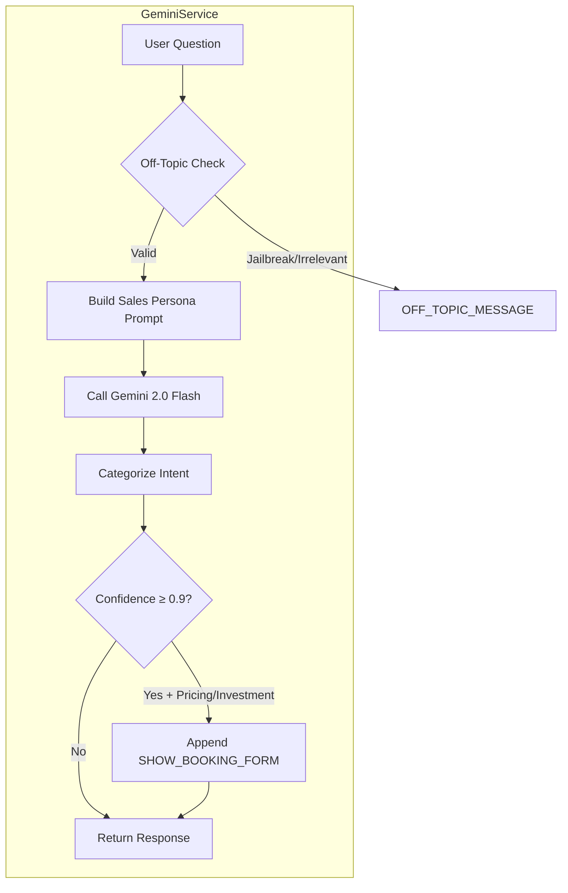

### Sales Persona Features

1. **Scope Restriction**: Only answers real estate/investment queries
2. **Attack Defense**: Rejects jailbreak attempts
3. **Urgency Creation**: "Units are selling fast"
4. **Value Justification**: Luxury amenities, ROI focus
5. **Booking Trigger**: High-confidence leads get `<SHOW_BOOKING_FORM>`

### Translation System

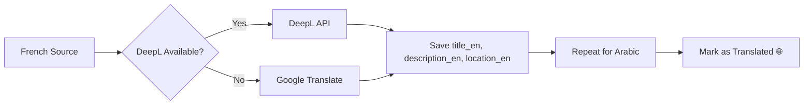

**Translatable Fields**: `title`, `description`, `location`

**Supported Languages**: French (source), English, Arabic (RTL)

---

## Security Analysis

### Current State

| Area | Status | Risk |
|------|--------|------|
| JWT Authentication | ✅ Implemented | Low |
| Admin Endpoints | ⚠️ AllowAny | **HIGH** |
| CORS | ✅ Configured | Low |
| SQL Injection | ✅ Django ORM | Low |
| XSS | ✅ React escaping | Low |
| CSRF | ⚠️ Disabled for API | Medium |
| Rate Limiting | ❌ Not implemented | Medium |
| Input Validation | ✅ Serializers | Low |

### Critical Security TODOs

> [!CAUTION]
> Multiple admin endpoints use `permission_classes = [AllowAny]` with TODO comments. These MUST be changed to `IsAdminUser` before production deployment.

**Affected Endpoints**:
- All `/api/content/admin/*`
- All `/api/chatbot/admin/*`
- All `/api/contacts/admin/*`
- All `/api/analytics/*` (dashboard endpoints)
- `/api/auth/admin/profile/`
- `/api/auth/admin/password/`

---

## Key Insights & Recommendations

### Strengths

1. **Modern Stack**: Django 6.0 + Next.js 16 represents cutting-edge technology choices
2. **AI Integration**: Gemini chatbot with sales persona is innovative
3. **Multilingual Support**: Database-level translations with auto-translate is well-architected
4. **Analytics**: Silent visitor tracking with geolocation provides valuable insights
5. **Code Organization**: Clean separation between apps and components

### Areas for Improvement

> [!WARNING]
> **Security**: All admin endpoints must be secured before production

> [!IMPORTANT]
> **Performance Considerations**:
> - `SpacesSection.tsx` (23KB) could benefit from code splitting
> - Consider pagination for listings API
> - Add caching for translated content

### Recommended Enhancements

1. **Authentication**
   - Implement proper `IsAdminUser` permissions
   - Add rate limiting for login attempts
   - Consider OAuth2 for social login

2. **Performance**
   - Add Redis caching for API responses
   - Implement lazy loading for images
   - Use ISR for static content in Next.js

3. **Features**
   - Add property comparison feature
   - Implement saved listings for registered users
   - Add email notifications for contact requests

4. **Monitoring**
   - Add error tracking (Sentry)
   - Implement API response time logging
   - Add chatbot interaction analytics dashboard

---

## Summary Statistics

| Metric | Value |
|--------|-------|
| **Backend Apps** | 5 (users, content, chatbot, contacts, analytics) |
| **Django Models** | 8 |
| **API Endpoints** | 25+ |
| **Frontend Components** | 15+ |
| **Supported Languages** | 3 (FR, EN, AR) |
| **External Integrations** | 4 (Gemini, DeepL, Google Translate, IP-API) |
| **Lines of Code (est.)** | 5,000+ |

---

*Analysis generated on February 3, 2026*
