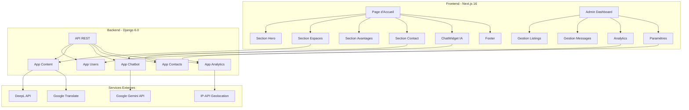
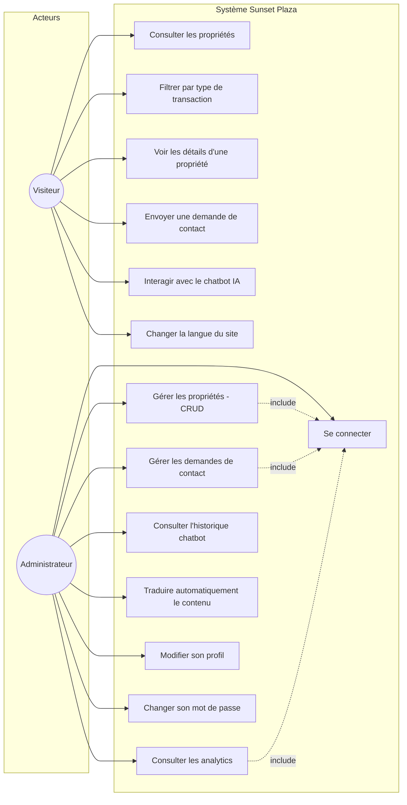
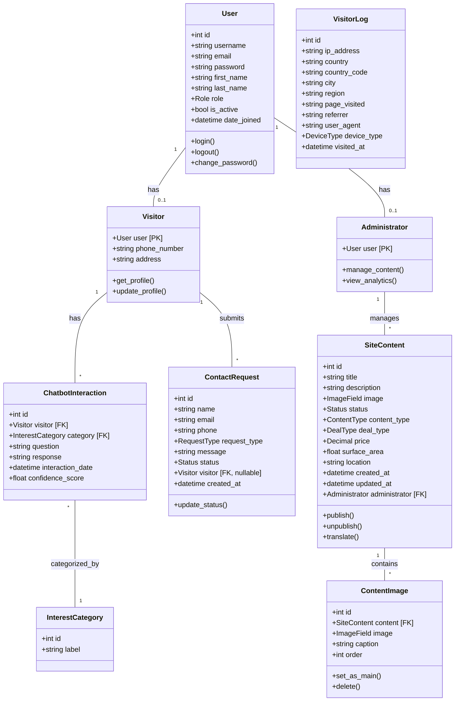
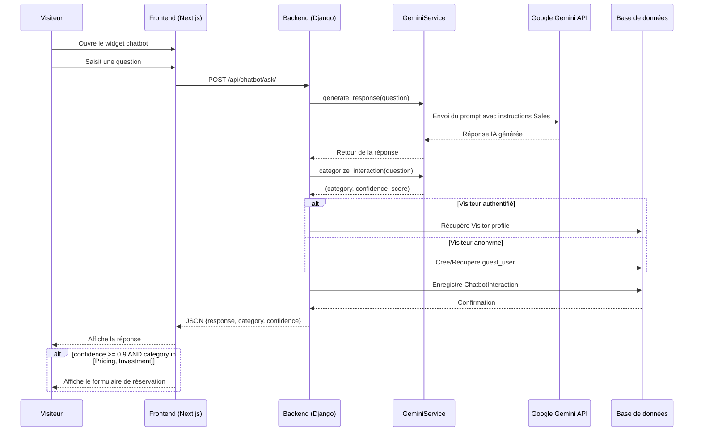
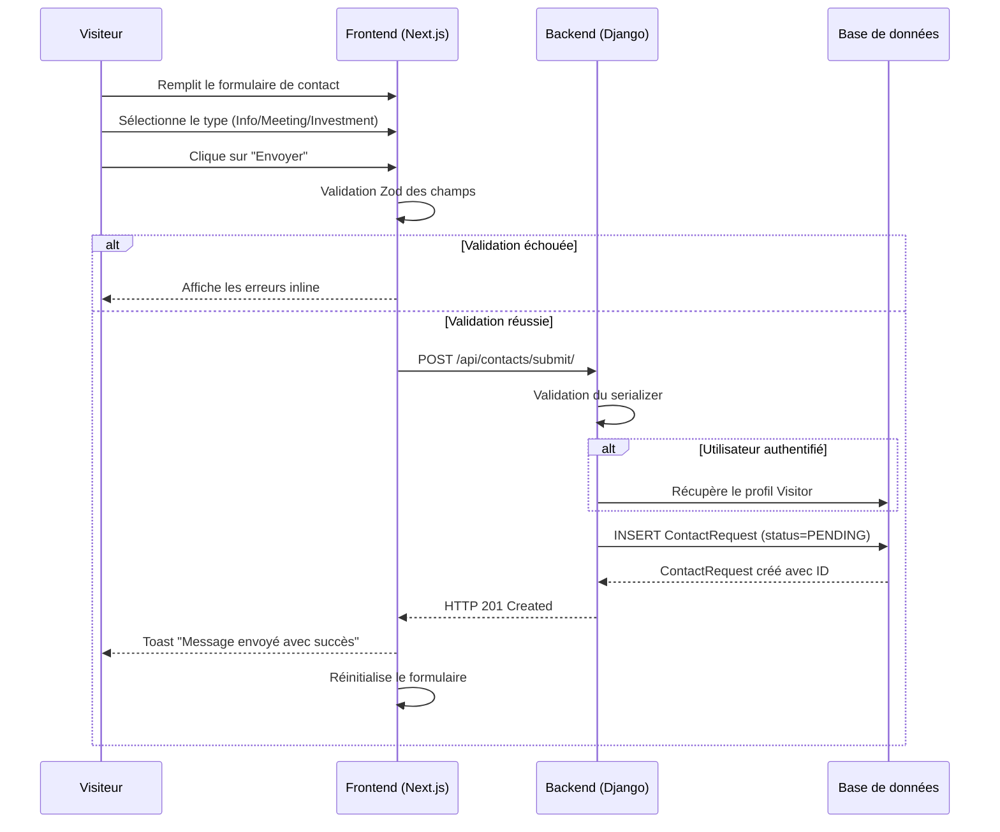
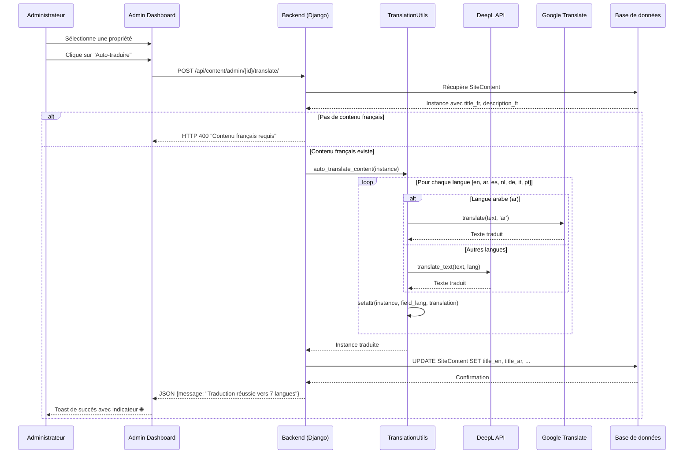
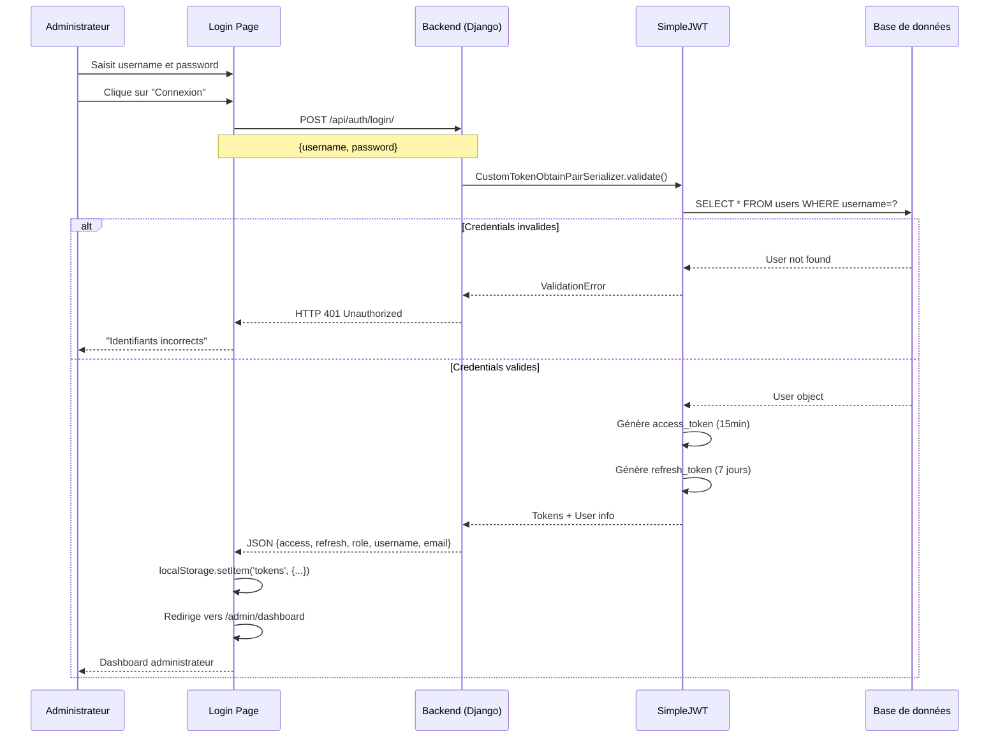
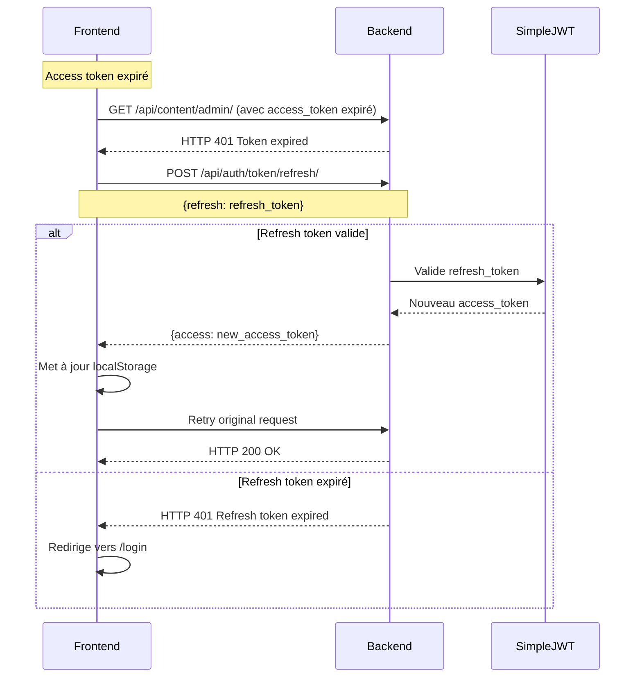
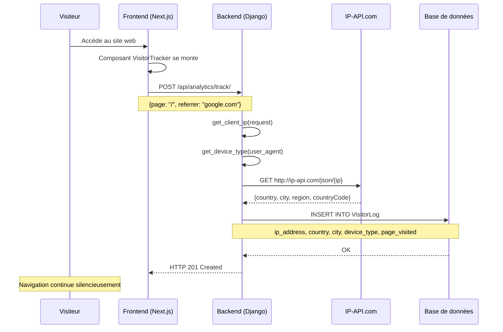
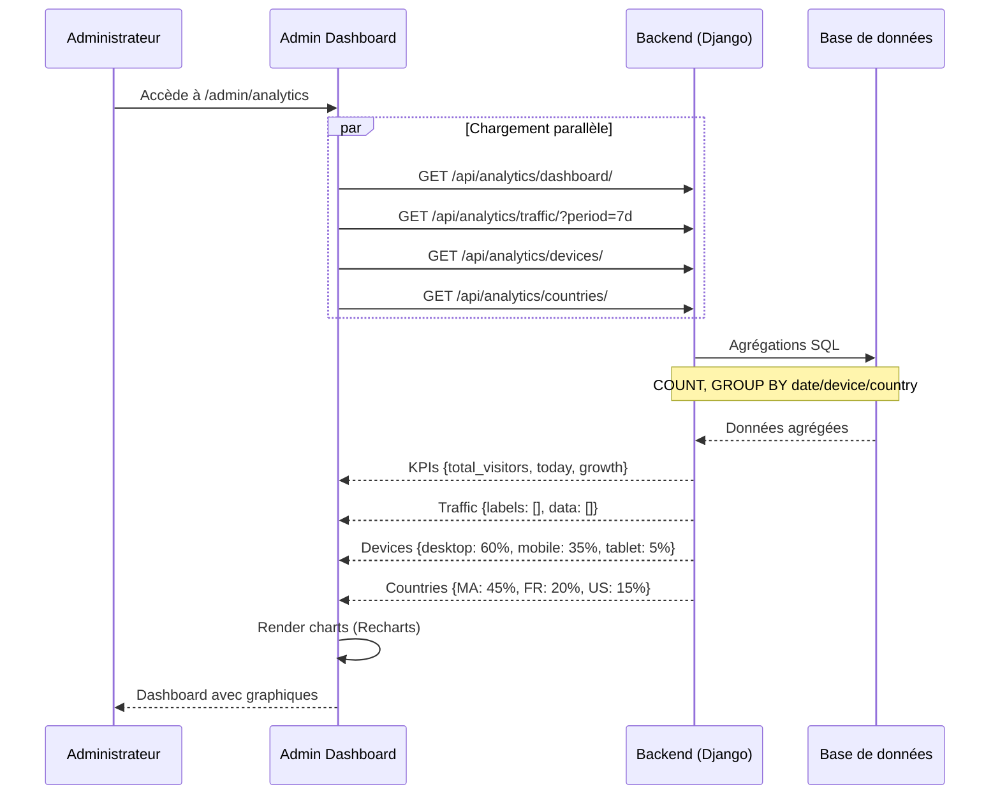

# Système de Gestion Immobilière Intelligent avec IA : cas pratique de l'application Sunset Plaza

---

## STAGE MINI-PROJET

---

**Période :** Du [Date de début] au [Date de fin]

**Nom et prénoms de l'étudiant :** Mohamed Elamine EL FELAOUSS

**Classe et Filière de l'Étudiant :** [Classe et Filière]

---

**ENCADRANT PROFESSIONNEL**

Nom et prénoms : [Nom de l'encadrant]

Fonction : [Fonction de l'encadrant]

---

**VISA ENCADRANT**

---

**Année universitaire : 2024 - 2025**

---

<div style="page-break-after: always;"></div>

# Système de Gestion Immobilière Intelligent avec IA : cas pratique de l'application Sunset Plaza

<div style="page-break-after: always;"></div>

## REMERCIEMENTS

Cher(e) [Nom de l'encadrant],

Je tiens à exprimer ma profonde gratitude pour votre accompagnement et vos conseils tout au long de ce projet. Votre expertise et votre dévouement m'ont permis d'acquérir des compétences inestimables dans le domaine du développement web full-stack et de l'intégration de l'intelligence artificielle. Votre soutien a été d'une importance cruciale, et je suis reconnaissant de la chance d'avoir pu bénéficier de vos enseignements.

À Madame/Monsieur le/la directeur(trice) de [Établissement],

Je tiens à exprimer ma gratitude pour l'environnement estudiantin propice à l'apprentissage que vous avez créé. Votre engagement envers un enseignement de qualité a joué un rôle essentiel dans ma formation. Merci de fournir un cadre éducatif qui favorise l'épanouissement académique et personnel des étudiants.

À mes professeurs,

Merci pour votre enseignement de qualité et votre dévouement envers notre réussite. Vos connaissances approfondies et votre engagement ont été une source constante d'inspiration.

Enfin, à mes parents,

Votre soutien financier et vos conseils avisés ont été les piliers de mon parcours éducatif. Je suis reconnaissant de la confiance que vous avez placée en moi, et cela a été un moteur essentiel dans la réalisation de mes projets.

Merci à tous pour avoir contribué à façonner mon parcours académique et professionnel.

Bien à vous,

EL FELAOUSS Mohamed Elamine

<div style="page-break-after: always;"></div>

## SOMMAIRE

- **INTRODUCTION GÉNÉRALE**
- **PARTIE I : PRÉSENTATION DU PROJET SUNSET PLAZA**
  - CHAPITRE I : Vue d'ensemble du projet
    - Section 1 : Contexte et objectifs
    - Section 2 : Périmètre fonctionnel et besoins
  - CHAPITRE II : Cahier des charges
    - Section 1 : Besoins fonctionnels
    - Section 2 : Besoins non fonctionnels
- **PARTIE II : ARCHITECTURE ET TECHNOLOGIES**
  - CHAPITRE I : Architecture du système
    - Section 1 : Architecture globale
    - Section 2 : Structure du projet
  - CHAPITRE II : Technologies utilisées
    - Section 1 : Stack Backend (Django)
    - Section 2 : Stack Frontend (Next.js)
- **PARTIE III : MODÉLISATION UML DU SYSTÈME**
  - CHAPITRE I : Diagramme de cas d'utilisation
    - Section 1 : Identification des acteurs
    - Section 2 : Cas d'utilisation du système
  - CHAPITRE II : Diagramme de classes
    - Section 1 : Modèles de données
    - Section 2 : Relations entre les entités
  - CHAPITRE III : Diagrammes de séquence
    - Section 1 : Interaction avec le chatbot IA
    - Section 2 : Gestion des demandes de contact
    - Section 3 : Traduction automatique du contenu
- **PARTIE IV : RÉALISATION ET IMPLÉMENTATION**
  - CHAPITRE I : Tâches réalisées et code source
    - Section 1 : Implémentation du module utilisateurs
    - Section 2 : Implémentation du module contenu
  - CHAPITRE II : Implémentation des fonctionnalités IA
    - Section 1 : Service Gemini pour le chatbot
    - Section 2 : Système de traduction automatique
  - CHAPITRE III : Diagrammes de séquence supplémentaires
    - Section 1 : Authentification administrateur
    - Section 2 : Tracking analytics des visiteurs
  - CHAPITRE IV : Défis techniques et solutions
    - Section 1 : Problèmes rencontrés
    - Section 2 : Optimisations apportées
    - Section 3 : Tests et validation
- **CONCLUSION GÉNÉRALE**
- **ANNEXES**
  - Annexe A : Composants Frontend clés
  - Annexe B : Configuration et Déploiement
- **WEBOGRAPHIES**
- **TABLE DES MATIÈRES**

<div style="page-break-after: always;"></div>

## Table des figures

| Figure | Description | Page |
|--------|-------------|------|
| Figure 1 | Architecture globale du système Sunset Plaza | 15 |
| Figure 2 | Diagramme de cas d'utilisation | 20 |
| Figure 3 | Diagramme de classes du système | 23 |
| Figure 4 | Diagramme de séquence - Interaction Chatbot IA | 26 |
| Figure 5 | Diagramme de séquence - Demande de contact | 27 |
| Figure 6 | Diagramme de séquence - Traduction automatique | 28 |
| Figure 7 | Diagramme de séquence - Authentification administrateur | 35 |
| Figure 8 | Diagramme de séquence - Rafraîchissement du token | 36 |
| Figure 9 | Diagramme de séquence - Tracking des visiteurs | 37 |
| Figure 10 | Diagramme de séquence - Dashboard analytics | 38 |

<div style="page-break-after: always;"></div>

## INTRODUCTION GÉNÉRALE

L'engagement pour l'innovation et l'efficacité dans le domaine du développement web et de l'intelligence artificielle se reflète au sein du projet **Sunset Plaza**, une plateforme immobilière premium où j'ai eu l'opportunité de développer une solution complète de gestion immobilière. Plongé dans un environnement de développement moderne, j'ai été amené à concevoir et implémenter une application web full-stack intégrant des fonctionnalités avancées d'intelligence artificielle.

Mon parcours dans ce projet a été marqué par une immersion dans les technologies modernes : **Django REST Framework** pour le backend, **Next.js 16** pour le frontend, et l'intégration de **Google Gemini** pour le chatbot IA. Cette expérience m'a permis de développer des compétences en développement agile, en architecture logicielle et en intégration de services d'IA.

Ce rapport de projet a pour objectif de retracer mon expérience et de détailler les réalisations accomplies, en particulier :

- La conception d'une API REST complète avec Django
- L'intégration d'un chatbot intelligent propulsé par Gemini
- La mise en place d'un système de traduction automatique multilingue
- Le développement d'un tableau de bord administrateur avec analytics

À travers ce document, je partagerai les défis rencontrés, les solutions apportées ainsi que les connaissances acquises sur le développement web moderne et l'intégration de l'IA. Ce rapport met en lumière la fusion entre les compétences techniques acquises en cours et leur application pratique, offrant ainsi une vision concrète des enjeux d'un ingénieur en informatique dans le domaine du développement full-stack.

<div style="page-break-after: always;"></div>

# PARTIE I : PRÉSENTATION DU PROJET SUNSET PLAZA

<div style="page-break-after: always;"></div>

## CHAPITRE I : Vue d'ensemble du projet

### Section 1 : Contexte et objectifs

Cette section aborde l'essence du projet Sunset Plaza, en se concentrant sur son contexte et ses objectifs principaux.

#### Paragraphe 1 : Contexte du projet

Dans un contexte où le secteur immobilier connaît une transformation numérique majeure, la nécessité de disposer d'outils modernes et intelligents pour la gestion des biens immobiliers devient primordiale. **Sunset Plaza** répond aux besoins du marché immobilier marocain, spécifiquement orienté vers la gestion et la commercialisation d'espaces de bureaux premium à Casablanca.

Le projet vise à développer une plateforme web complète qui combine :
- Une interface utilisateur moderne et responsive
- Des fonctionnalités d'IA avancées pour l'interaction client
- Un système multilingue automatisé
- Un tableau de bord analytique complet

#### Paragraphe 2 : Objectifs du projet

Les objectifs principaux de Sunset Plaza sont :

| Objectif | Description |
|----------|-------------|
| **Automatisation** | Automatiser les interactions avec les clients via un chatbot IA propulsé par Google Gemini |
| **Internationalisation** | Supporter 8 langues (FR, EN, AR, ES, NL, DE, IT, PT) avec traduction automatique |
| **Gestion centralisée** | Offrir un tableau de bord administrateur complet pour la gestion du contenu |
| **Analytics** | Suivre et analyser le comportement des visiteurs avec géolocalisation |
| **UX Premium** | Proposer une expérience utilisateur luxueuse inspirée des sites immobiliers haut de gamme |

### Section 2 : Périmètre fonctionnel et besoins

#### Paragraphe 1 : Périmètre fonctionnel

Le système Sunset Plaza couvre les domaines fonctionnels suivants :

1. **Gestion des utilisateurs** : Authentification JWT, gestion des rôles (Admin/Visiteur), profils utilisateurs
2. **Gestion du contenu** : CRUD complet des propriétés immobilières, gestion multi-images, publication/dépublication
3. **Chatbot IA** : Conversations intelligentes avec Google Gemini, catégorisation des intentions, déclenchement de formulaires
4. **Formulaires de contact** : Collecte et gestion des demandes clients avec suivi des statuts
5. **Analytics** : Suivi géographique et comportemental des visiteurs, statistiques par appareil
6. **Traduction automatique** : Traduction du contenu via DeepL (langues européennes) et Google Translate (arabe)

#### Paragraphe 2 : Identification des besoins

Le projet répond à plusieurs besoins identifiés :

- **Besoin de présence digitale** : Vitrine web moderne pour présenter les biens immobiliers
- **Besoin d'automatisation** : Réponse automatique aux questions des visiteurs 24/7
- **Besoin d'internationalisation** : Accès au marché international grâce au multilingue
- **Besoin de suivi** : Tableaux de bord pour suivre les performances et les contacts

<div style="page-break-after: always;"></div>

## CHAPITRE II : Cahier des charges

### Section 1 : Besoins fonctionnels

#### Paragraphe 1 : Module Utilisateurs

Le module utilisateurs comprend les fonctionnalités suivantes :

- **Authentification sécurisée** : Système JWT (JSON Web Token) avec tokens d'accès et de rafraîchissement
- **Gestion des rôles** : Deux rôles distincts - Administrateur et Visiteur
- **Profils personnalisables** : Numéro de téléphone, adresse pour les visiteurs
- **Modification de mot de passe** : Interface sécurisée pour le changement de mot de passe

#### Paragraphe 2 : Module Contenu

Le module contenu offre :

- **CRUD des propriétés** : Création, lecture, modification et suppression des annonces immobilières
- **Gestion multi-images** : Upload multiple d'images, réorganisation, définition de l'image principale
- **Types de transactions** : Location (RENT), Achat (BUY), Investissement (INVEST)
- **Statuts de publication** : Brouillon (DRAFT) et Publié (PUBLISHED)
- **Champs spécifiques** : Prix, surface, localisation, description multilingue

#### Paragraphe 3 : Module Chatbot IA

Le chatbot intelligent inclut :

- **Conversations contextuelles** : Réponses personnalisées sur l'immobilier grâce à Google Gemini
- **Catégorisation automatique** : Détection de l'intention (Pricing, Investment, Location, General Inquiry)
- **Score de confiance** : Évaluation de la pertinence de chaque interaction
- **Trigger de formulaire** : Déclenchement automatique du formulaire de réservation pour les intentions commerciales
- **Protection** : Garde-fous contre les questions hors-sujet et tentatives de jailbreak

#### Paragraphe 4 : Module Contact

Le module de contact permet :

- **Formulaire public** : Accessible sans authentification
- **Types de demandes** : Investissement, Information générale, Rendez-vous
- **Gestion des statuts** : En attente (PENDING), Contacté (CONTACTED), Clôturé (CLOSED)
- **Liaison optionnelle** : Association possible avec un visiteur enregistré

#### Paragraphe 5 : Module Analytics

Le système d'analytics offre :

- **Tracking des visiteurs** : Enregistrement IP, géolocalisation (pays, ville, région)
- **Détection des appareils** : Desktop, Mobile, Tablette
- **Statistiques temporelles** : Visiteurs par jour, semaine, mois
- **Dashboard visuel** : KPIs en temps réel, graphiques de trafic

#### Paragraphe 6 : Module Traduction

Le système de traduction propose :

- **Traduction automatique** : Du français vers 7 langues cibles
- **DeepL** : Pour EN, ES, NL, DE, IT, PT (haute qualité)
- **Google Translate** : Pour l'arabe (non supporté par DeepL)
- **Champs traduits** : Titre, description, localisation

### Section 2 : Besoins non fonctionnels

Les exigences non fonctionnelles du système sont :

| Critère | Exigence |
|---------|----------|
| **Performance** | Temps de réponse API < 2 secondes |
| **Sécurité** | JWT, validation des entrées, protection CSRF |
| **Disponibilité** | Application accessible 24/7 |
| **Scalabilité** | Architecture modulaire avec apps Django séparées |
| **Responsive** | Compatible mobile (375px+), tablette (768px+), desktop (1024px+) |
| **SEO** | Optimisation pour les moteurs de recherche avec Next.js SSR |
| **Accessibilité** | Composants Radix UI conformes WCAG |

<div style="page-break-after: always;"></div>

# PARTIE II : ARCHITECTURE ET TECHNOLOGIES

<div style="page-break-after: always;"></div>

## CHAPITRE I : Architecture du système

### Section 1 : Architecture globale

#### Paragraphe 1 : Vue d'ensemble de l'architecture

L'application Sunset Plaza suit une architecture **client-serveur moderne** où le frontend et le backend sont développés indépendamment et communiquent via une API RESTful.



*Figure 1 : Architecture globale du système Sunset Plaza*

#### Paragraphe 2 : Architecture en couches

L'application est structurée en 4 couches distinctes :

| Couche | Technologies | Responsabilité |
|--------|--------------|----------------|
| **Présentation** | Next.js 16, React 19, Tailwind CSS v4 | Interface utilisateur, routing, rendu |
| **API** | Django REST Framework, JWT | Endpoints REST, authentification |
| **Métier** | Services Python (Gemini, Translation) | Logique business, règles de validation |
| **Données** | Django ORM, SQLite/PostgreSQL | Persistance, modèles de données |

### Section 2 : Structure du projet

#### Paragraphe 1 : Organisation des fichiers

La structure du projet suit les conventions Django et Next.js :

```
sunset-plaza/
├── backend/                    # API Django 6.0
│   ├── apps/
│   │   ├── analytics/          # Tracking visiteurs
│   │   │   ├── models.py       # VisitorLog
│   │   │   ├── views.py        # APIs analytics
│   │   │   └── urls.py
│   │   ├── chatbot/            # Intelligence artificielle
│   │   │   ├── models.py       # ChatbotInteraction, InterestCategory
│   │   │   ├── services.py     # GeminiService
│   │   │   └── views.py
│   │   ├── contacts/           # Formulaires de contact
│   │   │   ├── models.py       # ContactRequest
│   │   │   └── views.py
│   │   ├── content/            # Gestion des propriétés
│   │   │   ├── models.py       # SiteContent, ContentImage
│   │   │   ├── translation_utils.py
│   │   │   └── views.py
│   │   └── users/              # Authentification
│   │       ├── models.py       # User, Visitor, Administrator
│   │       └── views.py
│   ├── config/                 # Configuration Django
│   │   ├── settings.py
│   │   └── urls.py
│   └── requirements.txt
│
├── frontend/                   # Application Next.js 16
│   ├── app/                    # Pages (App Router)
│   │   ├── admin/              # Dashboard administrateur
│   │   │   ├── analytics/
│   │   │   ├── chatbot/
│   │   │   ├── listings/
│   │   │   ├── messages/
│   │   │   └── settings/
│   │   └── page.tsx            # Page d'accueil
│   ├── components/             # Composants React
│   │   ├── admin/              # Composants admin
│   │   ├── ui/                 # Composants shadcn/ui
│   │   ├── ChatWidget.tsx
│   │   ├── SpacesSection.tsx
│   │   └── ...
│   ├── hooks/                  # Custom React Hooks
│   ├── lib/                    # Utilitaires et API
│   │   ├── api.ts
│   │   └── i18n.ts
│   └── messages/               # Fichiers i18n
│       ├── fr.json
│       ├── en.json
│       └── ar.json
│
└── docs/                       # Documentation
    └── IMPLEMENTATION_PLAN.md
```

#### Paragraphe 2 : Points d'entrée API

Les routes API sont organisées comme suit :

| Préfixe | Application | Description |
|---------|-------------|-------------|
| `/api/auth/` | users | Authentification, profils |
| `/api/content/` | content | Gestion des propriétés |
| `/api/chatbot/` | chatbot | Interactions IA |
| `/api/contacts/` | contacts | Demandes de contact |
| `/api/analytics/` | analytics | Statistiques visiteurs |

<div style="page-break-after: always;"></div>

## CHAPITRE II : Technologies utilisées

### Section 1 : Stack Backend (Django)

#### Paragraphe 1 : Technologies principales

| Technologie | Version | Rôle |
|-------------|---------|------|
| **Python** | 3.10+ | Langage de programmation |
| **Django** | 6.0 | Framework web high-level |
| **Django REST Framework** | Latest | Toolkit pour APIs REST |
| **SimpleJWT** | Latest | Authentification JWT |
| **django-modeltranslation** | Latest | Traductions en base de données |
| **Pillow** | Latest | Manipulation d'images |
| **SQLite / PostgreSQL** | - | Base de données |

#### Paragraphe 2 : Intégrations IA et Traduction

| Service | Bibliothèque | Utilisation |
|---------|--------------|-------------|
| **Google Gemini** | `google-genai` | Chatbot IA conversationnel |
| **DeepL** | `deepl` | Traduction haute qualité (EN, ES, DE, IT, NL, PT) |
| **Google Translate** | `deep-translator` | Traduction arabe |
| **IP-API** | `requests` | Géolocalisation des visiteurs |

### Section 2 : Stack Frontend (Next.js)

#### Paragraphe 1 : Framework et bibliothèques UI

| Technologie | Version | Rôle |
|-------------|---------|------|
| **Next.js** | 16 | Framework React avec App Router |
| **React** | 19 | Bibliothèque UI |
| **TypeScript** | 5.x | Typage statique |
| **Tailwind CSS** | v4 | Framework CSS utility-first |
| **Framer Motion** | 11 | Animations fluides |
| **Radix UI** | Latest | Composants accessibles unstyled |
| **Lucide React** | Latest | Icônes modernes |

#### Paragraphe 2 : Gestion d'état et internationalisation

| Technologie | Utilisation |
|-------------|-------------|
| **TanStack Query** | Gestion de l'état asynchrone et cache |
| **next-intl** | Internationalisation avec détection automatique |
| **Zod** | Validation de schémas pour les formulaires |
| **next-themes** | Gestion du thème clair/sombre |

<div style="page-break-after: always;"></div>

# PARTIE III : MODÉLISATION UML DU SYSTÈME

<div style="page-break-after: always;"></div>

## CHAPITRE I : Diagramme de cas d'utilisation

### Section 1 : Identification des acteurs

#### Paragraphe 1 : Acteur Visiteur

Le **Visiteur** représente tout utilisateur accédant au site web public. Il peut être anonyme ou authentifié. Ses principales interactions sont :

- Consulter les propriétés disponibles
- Filtrer les annonces par type (Location, Achat, Investissement)
- Interagir avec le chatbot IA
- Soumettre des demandes de contact
- Changer la langue de l'interface

#### Paragraphe 2 : Acteur Administrateur

L'**Administrateur** est un utilisateur authentifié avec des privilèges élevés. Ses responsabilités incluent :

- Gérer les propriétés (CRUD complet)
- Suivre et répondre aux demandes de contact
- Consulter les analytics et statistiques
- Lancer les traductions automatiques
- Gérer son profil et ses paramètres

### Section 2 : Cas d'utilisation du système

#### Paragraphe 1 : Diagramme de cas d'utilisation



*Figure 2 : Diagramme de cas d'utilisation du système Sunset Plaza*

#### Paragraphe 2 : Description des cas d'utilisation

| ID | Cas d'Utilisation | Acteur | Description |
|----|-------------------|--------|-------------|
| UC1 | Consulter les propriétés | Visiteur | Visualiser la liste des espaces publiés |
| UC2 | Filtrer par type | Visiteur | Filtrer par Location/Achat/Investissement |
| UC3 | Voir les détails | Visiteur | Afficher le modal avec détails complets |
| UC4 | Envoyer une demande | Visiteur | Remplir et soumettre le formulaire de contact |
| UC5 | Interagir avec le chatbot | Visiteur | Poser des questions à l'assistant Gemini |
| UC6 | Changer la langue | Visiteur | Basculer entre FR/EN/AR |
| UC7 | Se connecter | Admin | S'authentifier via JWT |
| UC8 | Gérer les propriétés | Admin | CRUD complet sur les annonces |
| UC9 | Gérer les demandes | Admin | Suivre et mettre à jour les statuts |
| UC10 | Consulter analytics | Admin | Visualiser les statistiques visiteurs |
| UC11 | Historique chatbot | Admin | Consulter les conversations IA |
| UC12 | Traduire contenu | Admin | Lancer la traduction automatique |
| UC13 | Modifier profil | Admin | Mettre à jour ses informations |
| UC14 | Changer mot de passe | Admin | Modifier son mot de passe |

<div style="page-break-after: always;"></div>

## CHAPITRE II : Diagramme de classes

### Section 1 : Modèles de données

#### Paragraphe 1 : Modèles principaux

Le système repose sur les modèles Django suivants :



*Figure 3 : Diagramme de classes du système Sunset Plaza*

### Section 2 : Relations entre les entités

#### Paragraphe 1 : Relations du module Utilisateurs

| Relation | Type | Description |
|----------|------|-------------|
| User → Visitor | One-to-One | Un utilisateur visiteur possède un profil Visitor |
| User → Administrator | One-to-One | Un utilisateur admin possède un profil Administrator |
| Administrator → SiteContent | One-to-Many | Un admin gère plusieurs contenus |

#### Paragraphe 2 : Relations des autres modules

| Relation | Type | Description |
|----------|------|-------------|
| SiteContent → ContentImage | One-to-Many | Une propriété peut avoir plusieurs images |
| Visitor → ContactRequest | One-to-Many | Un visiteur peut soumettre plusieurs demandes |
| Visitor → ChatbotInteraction | One-to-Many | Un visiteur a un historique de conversations |
| ChatbotInteraction → InterestCategory | Many-to-One | Chaque interaction est catégorisée |

<div style="page-break-after: always;"></div>

## CHAPITRE III : Diagrammes de séquence

### Section 1 : Interaction avec le chatbot IA

#### Paragraphe 1 : Flux de conversation



*Figure 4 : Diagramme de séquence - Interaction avec le Chatbot IA*

#### Paragraphe 2 : Logique du GeminiService

Le service GeminiService implémente :
- **Instructions de vente** : Le chatbot est configuré comme consultant immobilier commercial
- **Garde-fous** : Protection contre les questions hors-sujet
- **Catégorisation** : Détection automatique de l'intention (Pricing, Investment, Location, General)

### Section 2 : Gestion des demandes de contact

#### Paragraphe 1 : Soumission d'une demande



*Figure 5 : Diagramme de séquence - Soumission d'une demande de contact*

### Section 3 : Traduction automatique du contenu

#### Paragraphe 1 : Processus de traduction



*Figure 6 : Diagramme de séquence - Traduction automatique du contenu*

#### Paragraphe 2 : Services de traduction utilisés

| Langue cible | Service | Qualité |
|--------------|---------|---------|
| EN (Anglais) | DeepL | Haute |
| ES (Espagnol) | DeepL | Haute |
| NL (Néerlandais) | DeepL | Haute |
| DE (Allemand) | DeepL | Haute |
| IT (Italien) | DeepL | Haute |
| PT (Portugais) | DeepL | Haute |
| AR (Arabe) | Google Translate | Bonne |

<div style="page-break-after: always;"></div>

# PARTIE IV : RÉALISATION ET IMPLÉMENTATION

<div style="page-break-after: always;"></div>

## CHAPITRE I : Tâches réalisées et code source

### Section 1 : Implémentation du module utilisateurs

#### Paragraphe 1 : Modèle User personnalisé

Le modèle utilisateur étend AbstractUser de Django pour ajouter un système de rôles :

```python
# backend/apps/users/models.py

from django.contrib.auth.models import AbstractUser
from django.db import models
from django.db.models.signals import post_save
from django.dispatch import receiver

class User(AbstractUser):
    class Role(models.TextChoices):
        ADMIN = "ADMIN", "Administrator"
        VISITOR = "VISITOR", "Visitor"

    role = models.CharField(
        max_length=50,
        choices=Role.choices,
        default=Role.VISITOR,
    )

class Visitor(models.Model):
    user = models.OneToOneField(
        User, on_delete=models.CASCADE, 
        primary_key=True, 
        related_name="visitor_profile"
    )
    phone_number = models.CharField(max_length=20, blank=True, null=True)
    address = models.TextField(blank=True, null=True)

class Administrator(models.Model):
    user = models.OneToOneField(
        User, on_delete=models.CASCADE, 
        primary_key=True, 
        related_name="admin_profile"
    )

@receiver(post_save, sender=User)
def create_user_profile(sender, instance, created, **kwargs):
    """Signal pour créer automatiquement le profil approprié"""
    if created:
        if instance.is_superuser or instance.role == User.Role.ADMIN:
            Administrator.objects.get_or_create(user=instance)
        else:
            Visitor.objects.get_or_create(user=instance)
```

Ce code illustre plusieurs concepts importants :
- **Héritage de modèle** : Extension d'AbstractUser pour personnaliser l'authentification
- **Choix énumérés** : Utilisation de TextChoices pour les rôles
- **Signaux Django** : Création automatique de profils via post_save

#### Paragraphe 2 : Authentification JWT

L'authentification utilise SimpleJWT avec un serializer personnalisé :

```python
# backend/apps/users/views.py

from rest_framework_simplejwt.views import TokenObtainPairView
from rest_framework_simplejwt.serializers import TokenObtainPairSerializer

class CustomTokenObtainPairSerializer(TokenObtainPairSerializer):
    def validate(self, attrs):
        data = super().validate(attrs)
        # Ajout d'informations utilisateur dans la réponse
        data['role'] = self.user.role
        data['username'] = self.user.username
        data['email'] = self.user.email
        return data

class LoginView(TokenObtainPairView):
    serializer_class = CustomTokenObtainPairSerializer
```

### Section 2 : Implémentation du module contenu

#### Paragraphe 1 : Modèle SiteContent multilingue

Le modèle de contenu utilise django-modeltranslation pour le support multilingue :

```python
# backend/apps/content/models.py

class SiteContent(models.Model):
    class Status(models.TextChoices):
        DRAFT = "DRAFT", "Draft"
        PUBLISHED = "PUBLISHED", "Published"

    class DealType(models.TextChoices):
        RENT = "RENT", "Rent"
        BUY = "BUY", "Buy"
        INVEST = "INVEST", "Invest"

    title = models.CharField(max_length=255)
    description = models.TextField()
    status = models.CharField(
        max_length=50, 
        choices=Status.choices, 
        default=Status.DRAFT
    )
    deal_type = models.CharField(
        max_length=20,
        choices=DealType.choices,
        default=DealType.RENT
    )
    price = models.DecimalField(max_digits=12, decimal_places=2, null=True)
    surface_area = models.FloatField(null=True, help_text="Size in m²")
    location = models.CharField(max_length=100, blank=True, null=True)
    administrator = models.ForeignKey(
        Administrator,
        on_delete=models.SET_NULL,
        null=True,
        related_name="managed_content"
    )
    created_at = models.DateTimeField(auto_now_add=True)
    updated_at = models.DateTimeField(auto_now=True)
```

#### Paragraphe 2 : API de gestion du contenu

Les vues pour la gestion du contenu incluent le CRUD complet :

```python
# backend/apps/content/views.py

from rest_framework import status
from rest_framework.decorators import api_view, permission_classes
from rest_framework.permissions import IsAuthenticated
from rest_framework.response import Response

@api_view(['GET'])
def public_content_list(request):
    """Liste publique des propriétés publiées"""
    queryset = SiteContent.objects.filter(
        status=SiteContent.Status.PUBLISHED,
        content_type=SiteContent.ContentType.OFFICE
    ).order_by('-created_at')
    
    serializer = SiteContentSerializer(queryset, many=True)
    return Response(serializer.data)

@api_view(['POST'])
@permission_classes([IsAuthenticated])
def admin_create_content(request):
    """Création d'une nouvelle propriété (admin uniquement)"""
    if request.user.role != 'ADMIN':
        return Response(
            {"error": "Permission denied"}, 
            status=status.HTTP_403_FORBIDDEN
        )
    
    serializer = SiteContentSerializer(data=request.data)
    if serializer.is_valid():
        serializer.save(administrator=request.user.admin_profile)
        return Response(serializer.data, status=status.HTTP_201_CREATED)
    return Response(serializer.errors, status=status.HTTP_400_BAD_REQUEST)
```

<div style="page-break-after: always;"></div>

## CHAPITRE II : Implémentation des fonctionnalités IA

### Section 1 : Service Gemini pour le chatbot

#### Paragraphe 1 : Configuration du service

Le service GeminiService encapsule toute la logique d'interaction avec l'API Gemini :

```python
# backend/apps/chatbot/services.py

import google.generativeai as genai
from django.conf import settings

class GeminiService:
    def __init__(self):
        genai.configure(api_key=settings.GEMINI_API_KEY)
        self.model = genai.GenerativeModel('gemini-pro')
        
        self.system_prompt = """
        Tu es un consultant immobilier commercial expert pour Sunset Plaza, 
        un complexe de bureaux premium à Casablanca.
        
        INSTRUCTIONS:
        - Réponds toujours de manière professionnelle et enthousiaste
        - Mets en avant les avantages de nos espaces
        - Guide les clients vers une prise de rendez-vous
        - Ne discute que de sujets liés à l'immobilier
        
        INFORMATIONS SUNSET PLAZA:
        - Localisation: Casablanca, Maroc
        - Types d'espaces: Bureaux privés, Open spaces, Salles de réunion
        - Prix: À partir de 8,000 MAD/mois
        - Avantages: Vue panoramique, Parking privé, Sécurité 24/7
        """
    
    def generate_response(self, user_message: str) -> str:
        """Génère une réponse à partir du message utilisateur"""
        try:
            prompt = f"{self.system_prompt}\n\nQuestion client: {user_message}"
            response = self.model.generate_content(prompt)
            return response.text
        except Exception as e:
            return "Je suis désolé, je rencontre un problème technique. Veuillez réessayer."
    
    def categorize_interaction(self, message: str) -> tuple:
        """Catégorise l'intention du message avec un score de confiance"""
        categories = {
            'pricing': ['prix', 'coût', 'tarif', 'budget', 'combien'],
            'investment': ['investir', 'investissement', 'rendement', 'roi'],
            'location': ['où', 'adresse', 'emplacement', 'casablanca'],
            'visit': ['visite', 'visiter', 'rendez-vous', 'rencontrer']
        }
        
        message_lower = message.lower()
        for category, keywords in categories.items():
            matches = sum(1 for kw in keywords if kw in message_lower)
            if matches > 0:
                confidence = min(0.5 + (matches * 0.2), 1.0)
                return (category, confidence)
        
        return ('general', 0.3)
```

#### Paragraphe 2 : Vue API du chatbot

```python
# backend/apps/chatbot/views.py

@api_view(['POST'])
def chatbot_ask(request):
    """Endpoint principal du chatbot"""
    question = request.data.get('question', '')
    
    if not question:
        return Response(
            {"error": "Question is required"}, 
            status=status.HTTP_400_BAD_REQUEST
        )
    
    # Génération de la réponse
    gemini_service = GeminiService()
    response_text = gemini_service.generate_response(question)
    
    # Catégorisation de l'interaction
    category_name, confidence = gemini_service.categorize_interaction(question)
    
    # Récupération ou création du visiteur
    visitor = get_or_create_visitor(request)
    
    # Enregistrement de l'interaction
    category, _ = InterestCategory.objects.get_or_create(label=category_name)
    ChatbotInteraction.objects.create(
        visitor=visitor,
        category=category,
        question=question,
        response=response_text,
        confidence_score=confidence
    )
    
    return Response({
        "response": response_text,
        "category": category_name,
        "confidence": confidence,
        "show_booking_form": confidence >= 0.9 and category_name in ['pricing', 'investment']
    })
```

### Section 2 : Système de traduction automatique

#### Paragraphe 1 : Utilitaires de traduction

```python
# backend/apps/content/translation_utils.py

import deepl
from deep_translator import GoogleTranslator
from django.conf import settings

def translate_text(text: str, target_lang: str) -> str:
    """Traduit un texte vers la langue cible"""
    if not text:
        return ""
    
    # Arabe via Google Translate (non supporté par DeepL)
    if target_lang == 'ar':
        translator = GoogleTranslator(source='fr', target='ar')
        return translator.translate(text)
    
    # Autres langues via DeepL
    translator = deepl.Translator(settings.DEEPL_API_KEY)
    lang_map = {
        'en': 'EN-US',
        'es': 'ES',
        'nl': 'NL',
        'de': 'DE',
        'it': 'IT',
        'pt': 'PT-PT'
    }
    
    result = translator.translate_text(
        text, 
        target_lang=lang_map.get(target_lang, 'EN-US')
    )
    return result.text

def auto_translate_content(instance):
    """Traduit automatiquement tous les champs d'un SiteContent"""
    target_languages = ['en', 'ar', 'es', 'nl', 'de', 'it', 'pt']
    translatable_fields = ['title', 'description', 'location']
    
    for lang in target_languages:
        for field in translatable_fields:
            french_value = getattr(instance, f'{field}_fr', '')
            if french_value:
                translated = translate_text(french_value, lang)
                setattr(instance, f'{field}_{lang}', translated)
    
    instance.save()
    return instance
```

<div style="page-break-after: always;"></div>

## CHAPITRE III : Diagrammes de séquence supplémentaires

### Section 1 : Authentification administrateur

#### Paragraphe 1 : Flux d'authentification JWT



*Figure 7 : Diagramme de séquence - Authentification administrateur*

#### Paragraphe 2 : Rafraîchissement du token



*Figure 8 : Diagramme de séquence - Rafraîchissement du token*

### Section 2 : Tracking analytics des visiteurs

#### Paragraphe 1 : Enregistrement d'une visite



*Figure 9 : Diagramme de séquence - Tracking des visiteurs*

#### Paragraphe 2 : Consultation du dashboard analytics



*Figure 10 : Diagramme de séquence - Dashboard analytics*

<div style="page-break-after: always;"></div>

## CHAPITRE IV : Défis techniques et solutions

### Section 1 : Problèmes rencontrés

#### Paragraphe 1 : Gestion du CORS

L'un des premiers défis a été la configuration du CORS (Cross-Origin Resource Sharing) entre le frontend Next.js (port 3000) et le backend Django (port 8000).

**Problème** : Les requêtes API depuis le frontend étaient bloquées par le navigateur.

**Solution** : Configuration de django-cors-headers :

```python
# backend/config/settings.py

INSTALLED_APPS = [
    # ...
    'corsheaders',
]

MIDDLEWARE = [
    'corsheaders.middleware.CorsMiddleware',  # Doit être en premier
    'django.middleware.common.CommonMiddleware',
    # ...
]

CORS_ALLOWED_ORIGINS = [
    "http://localhost:3000",
    "http://127.0.0.1:3000",
]

CORS_ALLOW_CREDENTIALS = True
```

#### Paragraphe 2 : Optimisation des requêtes N+1

**Problème** : Les performances se dégradaient lors du chargement des propriétés avec leurs images.

**Solution** : Utilisation de `prefetch_related` :

```python
# Avant (N+1 queries)
contents = SiteContent.objects.all()
for content in contents:
    images = content.images.all()  # Requête à chaque itération

# Après (2 queries seulement)
contents = SiteContent.objects.prefetch_related('images').all()
```

### Section 2 : Optimisations apportées

#### Paragraphe 1 : Cache des traductions

Pour éviter des appels API répétés aux services de traduction :

```python
from django.core.cache import cache

def translate_with_cache(text: str, target_lang: str) -> str:
    """Traduction avec mise en cache"""
    cache_key = f"translation:{hash(text)}:{target_lang}"
    cached = cache.get(cache_key)
    
    if cached:
        return cached
    
    translated = translate_text(text, target_lang)
    cache.set(cache_key, translated, timeout=86400)  # 24 heures
    return translated
```

#### Paragraphe 2 : Lazy loading des images

Côté frontend, optimisation du chargement des images :

```typescript
// components/SpacesSection.tsx

<Image
  src={space.image_url}
  alt={space.title}
  width={400}
  height={300}
  loading="lazy"
  placeholder="blur"
  blurDataURL="/placeholder.jpg"
/>
```

### Section 3 : Tests et validation

#### Paragraphe 1 : Tests unitaires backend

```python
# backend/apps/chatbot/tests.py

from django.test import TestCase
from .services import GeminiService

class GeminiServiceTest(TestCase):
    def setUp(self):
        self.service = GeminiService()
    
    def test_categorize_pricing_question(self):
        """Test la catégorisation d'une question sur les prix"""
        category, confidence = self.service.categorize_interaction(
            "Quel est le prix d'un bureau ?"
        )
        self.assertEqual(category, 'pricing')
        self.assertGreaterEqual(confidence, 0.5)
    
    def test_categorize_general_question(self):
        """Test la catégorisation d'une question générale"""
        category, confidence = self.service.categorize_interaction(
            "Bonjour, comment allez-vous ?"
        )
        self.assertEqual(category, 'general')
        self.assertLess(confidence, 0.5)
```

#### Paragraphe 2 : Tests d'intégration API

```python
# backend/apps/content/tests.py

from rest_framework.test import APITestCase
from rest_framework import status

class ContentAPITest(APITestCase):
    def test_public_content_list(self):
        """Test l'accès public à la liste des propriétés"""
        response = self.client.get('/api/content/')
        self.assertEqual(response.status_code, status.HTTP_200_OK)
    
    def test_admin_create_without_auth(self):
        """Test la création sans authentification (doit échouer)"""
        response = self.client.post('/api/content/admin/', {
            'title': 'Test',
            'description': 'Test description'
        })
        self.assertEqual(response.status_code, status.HTTP_401_UNAUTHORIZED)
```

<div style="page-break-after: always;"></div>

## CONCLUSION GÉNÉRALE

Au terme de ce projet de développement de la plateforme **Sunset Plaza**, une immersion approfondie dans le monde du développement web moderne et de l'intégration de l'intelligence artificielle a été réalisée. Cette expérience a permis de comprendre de manière concrète les défis et opportunités liés à la création d'une application full-stack complète intégrant des services d'IA.

### Compétences acquises

Au cours de ce projet, j'ai acquis une expérience significative dans :

- **Développement Backend** : Maîtrise de Django 6.0 et Django REST Framework pour la création d'APIs robustes
- **Développement Frontend** : Utilisation de Next.js 16 avec TypeScript pour une interface utilisateur moderne et performante
- **Intégration IA** : Utilisation de Google Gemini pour créer un chatbot conversationnel intelligent
- **Internationalisation** : Mise en place d'un système multilingue avec traduction automatique
- **Modélisation UML** : Conception de diagrammes de cas d'utilisation, de classes et de séquence

### Fonctionnalités réalisées

| Module | État |
|--------|------|
| Authentification JWT | ✅ Implémenté |
| CRUD Propriétés avec multi-images | ✅ Implémenté |
| Chatbot IA Gemini | ✅ Implémenté |
| Traduction automatique (8 langues) | ✅ Implémenté |
| Formulaire de contact | ✅ Implémenté |
| Analytics visiteurs avec géolocalisation | ✅ Implémenté |
| Interface responsive premium | ✅ Implémenté |
| Dashboard administrateur | ✅ Implémenté |

### Perspectives d'évolution

Plusieurs pistes d'amélioration peuvent être envisagées :

1. **Espace Client** : Portail dédié pour les propriétaires avec suivi de leurs actifs
2. **Paiement en ligne** : Intégration de solutions de paiement (Stripe, PayPal)
3. **WebSocket** : Notifications en temps réel pour le chatbot et les messages
4. **Application Mobile** : Version React Native de la plateforme
5. **IA Avancée** : Recommandations personnalisées basées sur l'historique de navigation

En conclusion, ce projet m'a offert une perspective précieuse sur le développement d'applications web modernes intégrant l'intelligence artificielle. Les défis surmontés et les solutions apportées contribuent à préparer le terrain pour une carrière future dans le développement full-stack avec une orientation particulière vers l'IA.

<div style="page-break-after: always;"></div>

## ANNEXES

### Annexe A : Composants Frontend clés

#### A.1 : Composant ChatWidget

Le composant ChatWidget gère l'interface utilisateur du chatbot IA :

```typescript
// frontend/components/ChatWidget.tsx

"use client";

import { useState, useRef, useEffect } from "react";
import { motion, AnimatePresence } from "framer-motion";
import { MessageCircle, X, Send, Loader2 } from "lucide-react";
import { Button } from "@/components/ui/button";
import { Input } from "@/components/ui/input";

interface Message {
  id: string;
  role: "user" | "assistant";
  content: string;
  timestamp: Date;
}

export function ChatWidget() {
  const [isOpen, setIsOpen] = useState(false);
  const [messages, setMessages] = useState<Message[]>([]);
  const [input, setInput] = useState("");
  const [isLoading, setIsLoading] = useState(false);
  const messagesEndRef = useRef<HTMLDivElement>(null);

  const scrollToBottom = () => {
    messagesEndRef.current?.scrollIntoView({ behavior: "smooth" });
  };

  useEffect(() => {
    scrollToBottom();
  }, [messages]);

  const sendMessage = async () => {
    if (!input.trim() || isLoading) return;

    const userMessage: Message = {
      id: Date.now().toString(),
      role: "user",
      content: input,
      timestamp: new Date(),
    };

    setMessages((prev) => [...prev, userMessage]);
    setInput("");
    setIsLoading(true);

    try {
      const response = await fetch("/api/chatbot/ask/", {
        method: "POST",
        headers: { "Content-Type": "application/json" },
        body: JSON.stringify({ question: input }),
      });

      const data = await response.json();

      const assistantMessage: Message = {
        id: (Date.now() + 1).toString(),
        role: "assistant",
        content: data.response,
        timestamp: new Date(),
      };

      setMessages((prev) => [...prev, assistantMessage]);

      if (data.show_booking_form) {
        // Afficher le formulaire de réservation
        window.dispatchEvent(new CustomEvent("open-booking-form"));
      }
    } catch (error) {
      console.error("Error sending message:", error);
    } finally {
      setIsLoading(false);
    }
  };

  return (
    <>
      {/* Bouton flottant */}
      <motion.button
        onClick={() => setIsOpen(true)}
        className="fixed bottom-6 right-6 z-50 bg-amber-500 hover:bg-amber-600 
                   text-white rounded-full p-4 shadow-lg"
        whileHover={{ scale: 1.1 }}
        whileTap={{ scale: 0.9 }}
      >
        <MessageCircle className="w-6 h-6" />
      </motion.button>

      {/* Fenêtre de chat */}
      <AnimatePresence>
        {isOpen && (
          <motion.div
            initial={{ opacity: 0, y: 100 }}
            animate={{ opacity: 1, y: 0 }}
            exit={{ opacity: 0, y: 100 }}
            className="fixed bottom-24 right-6 z-50 w-96 h-[500px] 
                       bg-white rounded-2xl shadow-2xl flex flex-col"
          >
            {/* Header */}
            <div className="p-4 bg-amber-500 text-white rounded-t-2xl flex justify-between">
              <span className="font-semibold">Assistant Sunset Plaza</span>
              <button onClick={() => setIsOpen(false)}>
                <X className="w-5 h-5" />
              </button>
            </div>

            {/* Messages */}
            <div className="flex-1 overflow-y-auto p-4 space-y-4">
              {messages.map((msg) => (
                <div
                  key={msg.id}
                  className={`flex ${msg.role === "user" ? "justify-end" : "justify-start"}`}
                >
                  <div
                    className={`max-w-[80%] p-3 rounded-lg ${
                      msg.role === "user"
                        ? "bg-amber-500 text-white"
                        : "bg-gray-100 text-gray-800"
                    }`}
                  >
                    {msg.content}
                  </div>
                </div>
              ))}
              {isLoading && (
                <div className="flex justify-start">
                  <Loader2 className="w-5 h-5 animate-spin text-amber-500" />
                </div>
              )}
              <div ref={messagesEndRef} />
            </div>

            {/* Input */}
            <div className="p-4 border-t flex gap-2">
              <Input
                value={input}
                onChange={(e) => setInput(e.target.value)}
                onKeyPress={(e) => e.key === "Enter" && sendMessage()}
                placeholder="Posez votre question..."
                disabled={isLoading}
              />
              <Button onClick={sendMessage} disabled={isLoading}>
                <Send className="w-4 h-4" />
              </Button>
            </div>
          </motion.div>
        )}
      </AnimatePresence>
    </>
  );
}
```

<div style="page-break-after: always;"></div>

#### A.2 : Composant SpacesSection

Ce composant affiche la galerie des propriétés avec filtrage :

```typescript
// frontend/components/SpacesSection.tsx

"use client";

import { useState, useEffect } from "react";
import { motion } from "framer-motion";
import Image from "next/image";
import { useTranslations } from "next-intl";

type DealType = "ALL" | "RENT" | "BUY" | "INVEST";

interface Space {
  id: number;
  title: string;
  description: string;
  image_url: string;
  price: number;
  surface_area: number;
  deal_type: DealType;
  location: string;
}

export function SpacesSection() {
  const t = useTranslations("spaces");
  const [spaces, setSpaces] = useState<Space[]>([]);
  const [filter, setFilter] = useState<DealType>("ALL");
  const [loading, setLoading] = useState(true);

  useEffect(() => {
    const fetchSpaces = async () => {
      try {
        const response = await fetch("/api/content/");
        const data = await response.json();
        setSpaces(data);
      } catch (error) {
        console.error("Error fetching spaces:", error);
      } finally {
        setLoading(false);
      }
    };

    fetchSpaces();
  }, []);

  const filteredSpaces = filter === "ALL" 
    ? spaces 
    : spaces.filter((s) => s.deal_type === filter);

  const formatPrice = (price: number) => {
    return new Intl.NumberFormat("fr-MA", {
      style: "currency",
      currency: "MAD",
    }).format(price);
  };

  return (
    <section id="spaces" className="py-20 bg-gray-50">
      <div className="container mx-auto px-4">
        <h2 className="text-4xl font-bold text-center mb-4">
          {t("title")}
        </h2>
        <p className="text-gray-600 text-center mb-12">
          {t("subtitle")}
        </p>

        {/* Filtres */}
        <div className="flex justify-center gap-4 mb-12">
          {(["ALL", "RENT", "BUY", "INVEST"] as DealType[]).map((type) => (
            <button
              key={type}
              onClick={() => setFilter(type)}
              className={`px-6 py-2 rounded-full transition-all ${
                filter === type
                  ? "bg-amber-500 text-white"
                  : "bg-white text-gray-700 hover:bg-amber-100"
              }`}
            >
              {t(`filter.${type.toLowerCase()}`)}
            </button>
          ))}
        </div>

        {/* Grille des espaces */}
        <div className="grid grid-cols-1 md:grid-cols-2 lg:grid-cols-3 gap-8">
          {filteredSpaces.map((space, index) => (
            <motion.div
              key={space.id}
              initial={{ opacity: 0, y: 20 }}
              animate={{ opacity: 1, y: 0 }}
              transition={{ delay: index * 0.1 }}
              className="bg-white rounded-xl overflow-hidden shadow-lg 
                         hover:shadow-xl transition-shadow"
            >
              <div className="relative h-64">
                <Image
                  src={space.image_url}
                  alt={space.title}
                  fill
                  className="object-cover"
                  loading="lazy"
                />
                <span className="absolute top-4 right-4 bg-amber-500 
                                 text-white px-3 py-1 rounded-full text-sm">
                  {t(`filter.${space.deal_type.toLowerCase()}`)}
                </span>
              </div>
              
              <div className="p-6">
                <h3 className="text-xl font-semibold mb-2">{space.title}</h3>
                <p className="text-gray-600 mb-4 line-clamp-2">
                  {space.description}
                </p>
                
                <div className="flex justify-between items-center">
                  <span className="text-amber-600 font-bold text-lg">
                    {formatPrice(space.price)}/mois
                  </span>
                  <span className="text-gray-500">
                    {space.surface_area} m²
                  </span>
                </div>
              </div>
            </motion.div>
          ))}
        </div>
      </div>
    </section>
  );
}
```

<div style="page-break-after: always;"></div>

### Annexe B : Configuration et Déploiement

#### B.1 : Configuration Django (settings.py)

```python
# backend/config/settings.py

from pathlib import Path
from datetime import timedelta
import os

BASE_DIR = Path(__file__).resolve().parent.parent

SECRET_KEY = os.environ.get('DJANGO_SECRET_KEY', 'development-secret-key')
DEBUG = os.environ.get('DEBUG', 'True') == 'True'

ALLOWED_HOSTS = ['localhost', '127.0.0.1', '.vercel.app']

INSTALLED_APPS = [
    'django.contrib.admin',
    'django.contrib.auth',
    'django.contrib.contenttypes',
    'django.contrib.sessions',
    'django.contrib.messages',
    'django.contrib.staticfiles',
    # Third-party
    'rest_framework',
    'rest_framework_simplejwt',
    'corsheaders',
    'modeltranslation',
    # Apps locales
    'apps.users',
    'apps.content',
    'apps.chatbot',
    'apps.contacts',
    'apps.analytics',
]

REST_FRAMEWORK = {
    'DEFAULT_AUTHENTICATION_CLASSES': (
        'rest_framework_simplejwt.authentication.JWTAuthentication',
    ),
    'DEFAULT_PERMISSION_CLASSES': [
        'rest_framework.permissions.AllowAny',
    ],
}

SIMPLE_JWT = {
    'ACCESS_TOKEN_LIFETIME': timedelta(minutes=15),
    'REFRESH_TOKEN_LIFETIME': timedelta(days=7),
    'ROTATE_REFRESH_TOKENS': True,
}

AUTH_USER_MODEL = 'users.User'

# Clés API
GEMINI_API_KEY = os.environ.get('GEMINI_API_KEY')
DEEPL_API_KEY = os.environ.get('DEEPL_API_KEY')

# Internationalisation
LANGUAGES = [
    ('fr', 'Français'),
    ('en', 'English'),
    ('ar', 'العربية'),
    ('es', 'Español'),
    ('nl', 'Nederlands'),
    ('de', 'Deutsch'),
    ('it', 'Italiano'),
    ('pt', 'Português'),
]
MODELTRANSLATION_DEFAULT_LANGUAGE = 'fr'
```

#### B.2 : Configuration Next.js (next.config.ts)

```typescript
// frontend/next.config.ts

import type { NextConfig } from "next";
import createNextIntlPlugin from "next-intl/plugin";

const withNextIntl = createNextIntlPlugin();

const nextConfig: NextConfig = {
  images: {
    remotePatterns: [
      {
        protocol: "https",
        hostname: "**",
      },
    ],
  },
  async rewrites() {
    return [
      {
        source: "/api/:path*",
        destination: "http://localhost:8000/api/:path*",
      },
    ];
  },
};

export default withNextIntl(nextConfig);
```

<div style="page-break-after: always;"></div>

## WEBOGRAPHIES

### 1. Documentation Django
- **URL** : https://docs.djangoproject.com/en/6.0/
- **Description** : Documentation officielle de Django 6.0, utilisée pour la configuration du backend, les modèles et les vues.

### 2. Django REST Framework
- **URL** : https://www.django-rest-framework.org/
- **Description** : Documentation du toolkit pour la création d'APIs REST, essentielle pour les endpoints du projet.

### 3. Next.js Documentation
- **URL** : https://nextjs.org/docs
- **Description** : Guide officiel de Next.js, utilisé pour le routing, le SSR et l'optimisation du frontend.

### 4. Google Gemini API
- **URL** : https://ai.google.dev/docs
- **Description** : Documentation de l'API Gemini pour l'intégration du chatbot intelligent.

### 5. DeepL API
- **URL** : https://www.deepl.com/docs-api
- **Description** : Documentation de l'API DeepL pour la traduction automatique haute qualité.

### 6. Tailwind CSS
- **URL** : https://tailwindcss.com/docs
- **Description** : Framework CSS utility-first utilisé pour le design responsive et moderne.

### 7. Radix UI
- **URL** : https://www.radix-ui.com/docs
- **Description** : Composants UI accessibles et unstyled utilisés avec shadcn/ui.

### 8. Framer Motion
- **URL** : https://www.framer.com/motion/
- **Description** : Bibliothèque d'animations pour React utilisée pour les transitions fluides.

Ces ressources m'ont fourni des bases solides pour comprendre les différents aspects techniques du projet, ce qui a facilité la réalisation des fonctionnalités et la rédaction de ce rapport.

<div style="page-break-after: always;"></div>

## TABLE DES MATIÈRES

**INTRODUCTION GÉNÉRALE** ................................................................................................................ 6

**PARTIE I : PRÉSENTATION DU PROJET SUNSET PLAZA** ......................................................... 7

- **CHAPITRE I : Vue d'ensemble du projet** .......................................................................................... 8
  - Section 1 : Contexte et objectifs ........................................................................................................... 8
    - Paragraphe 1 : Contexte du projet ................................................................................................. 8
    - Paragraphe 2 : Objectifs du projet ................................................................................................. 8
  - Section 2 : Périmètre fonctionnel et besoins ........................................................................................ 9
    - Paragraphe 1 : Périmètre fonctionnel ............................................................................................ 9
    - Paragraphe 2 : Identification des besoins ..................................................................................... 9

- **CHAPITRE II : Cahier des charges** ................................................................................................... 10
  - Section 1 : Besoins fonctionnels .......................................................................................................... 10
    - Paragraphe 1 : Module Utilisateurs .............................................................................................. 10
    - Paragraphe 2 : Module Contenu ................................................................................................... 10
    - Paragraphe 3 : Module Chatbot IA ............................................................................................... 10
    - Paragraphe 4 : Module Contact .................................................................................................... 11
    - Paragraphe 5 : Module Analytics .................................................................................................. 11
    - Paragraphe 6 : Module Traduction ............................................................................................... 11
  - Section 2 : Besoins non fonctionnels .................................................................................................. 12

**PARTIE II : ARCHITECTURE ET TECHNOLOGIES** .................................................................. 13

- **CHAPITRE I : Architecture du système** ........................................................................................... 14
  - Section 1 : Architecture globale .......................................................................................................... 14
    - Paragraphe 1 : Vue d'ensemble de l'architecture ....................................................................... 14
    - Paragraphe 2 : Architecture en couches ...................................................................................... 15
  - Section 2 : Structure du projet ............................................................................................................ 16
    - Paragraphe 1 : Organisation des fichiers ..................................................................................... 16
    - Paragraphe 2 : Points d'entrée API .............................................................................................. 17

- **CHAPITRE II : Technologies utilisées** .............................................................................................. 18
  - Section 1 : Stack Backend (Django) .................................................................................................... 18
    - Paragraphe 1 : Technologies principales ..................................................................................... 18
    - Paragraphe 2 : Intégrations IA et Traduction .............................................................................. 18
  - Section 2 : Stack Frontend (Next.js) ................................................................................................... 19
    - Paragraphe 1 : Framework et bibliothèques UI ........................................................................... 19
    - Paragraphe 2 : Gestion d'état et internationalisation ................................................................. 19

**PARTIE III : MODÉLISATION UML DU SYSTÈME** ................................................................... 20

- **CHAPITRE I : Diagramme de cas d'utilisation** ............................................................................... 21
  - Section 1 : Identification des acteurs .................................................................................................. 21
    - Paragraphe 1 : Acteur Visiteur ..................................................................................................... 21
    - Paragraphe 2 : Acteur Administrateur ......................................................................................... 21
  - Section 2 : Cas d'utilisation du système ............................................................................................. 22
    - Paragraphe 1 : Diagramme de cas d'utilisation .......................................................................... 22
    - Paragraphe 2 : Description des cas d'utilisation ......................................................................... 22

- **CHAPITRE II : Diagramme de classes** ............................................................................................. 23
  - Section 1 : Modèles de données .......................................................................................................... 23
    - Paragraphe 1 : Modèles principaux .............................................................................................. 23
  - Section 2 : Relations entre les entités ................................................................................................. 24
    - Paragraphe 1 : Relations du module Utilisateurs ........................................................................ 24
    - Paragraphe 2 : Relations des autres modules .............................................................................. 24

- **CHAPITRE III : Diagrammes de séquence** ...................................................................................... 25
  - Section 1 : Interaction avec le chatbot IA ........................................................................................... 25
    - Paragraphe 1 : Flux de conversation ............................................................................................ 25
    - Paragraphe 2 : Logique du GeminiService ................................................................................... 26
  - Section 2 : Gestion des demandes de contact ..................................................................................... 27
    - Paragraphe 1 : Soumission d'une demande ................................................................................. 27
  - Section 3 : Traduction automatique du contenu ................................................................................. 28
    - Paragraphe 1 : Processus de traduction ....................................................................................... 28
    - Paragraphe 2 : Services de traduction utilisés ............................................................................. 28

**PARTIE IV : RÉALISATION ET IMPLÉMENTATION** ............................................................... 29

- **CHAPITRE I : Tâches réalisées et code source** ............................................................................... 30
  - Section 1 : Implémentation du module utilisateurs ............................................................................ 30
    - Paragraphe 1 : Modèle User personnalisé ................................................................................... 30
    - Paragraphe 2 : Authentification JWT ........................................................................................... 31
  - Section 2 : Implémentation du module contenu ................................................................................. 32
    - Paragraphe 1 : Modèle SiteContent multilingue ......................................................................... 32
    - Paragraphe 2 : API de gestion du contenu .................................................................................. 33

- **CHAPITRE II : Implémentation des fonctionnalités IA** ................................................................. 34
  - Section 1 : Service Gemini pour le chatbot ......................................................................................... 34
    - Paragraphe 1 : Configuration du service ...................................................................................... 34
    - Paragraphe 2 : Vue API du chatbot .............................................................................................. 35
  - Section 2 : Système de traduction automatique .................................................................................. 36
    - Paragraphe 1 : Utilitaires de traduction ....................................................................................... 36

- **CHAPITRE III : Diagrammes de séquence supplémentaires** ......................................................... 37
  - Section 1 : Authentification administrateur ........................................................................................ 37
    - Paragraphe 1 : Flux d'authentification JWT ................................................................................ 37
    - Paragraphe 2 : Rafraîchissement du token .................................................................................. 38
  - Section 2 : Tracking analytics des visiteurs ........................................................................................ 39
    - Paragraphe 1 : Enregistrement d'une visite ................................................................................. 39
    - Paragraphe 2 : Consultation du dashboard analytics .................................................................. 40

- **CHAPITRE IV : Défis techniques et solutions** ................................................................................. 41
  - Section 1 : Problèmes rencontrés ........................................................................................................ 41
    - Paragraphe 1 : Gestion du CORS ................................................................................................. 41
    - Paragraphe 2 : Optimisation des requêtes N+1 .......................................................................... 42
  - Section 2 : Optimisations apportées .................................................................................................... 43
    - Paragraphe 1 : Cache des traductions .......................................................................................... 43
    - Paragraphe 2 : Lazy loading des images ...................................................................................... 43
  - Section 3 : Tests et validation .............................................................................................................. 44
    - Paragraphe 1 : Tests unitaires backend ....................................................................................... 44
    - Paragraphe 2 : Tests d'intégration API ........................................................................................ 44

**CONCLUSION GÉNÉRALE** ................................................................................................................. 45

**ANNEXES** ................................................................................................................................................. 46

- Annexe A : Composants Frontend clés .................................................................................................... 46
  - A.1 : Composant ChatWidget ................................................................................................................ 46
  - A.2 : Composant SpacesSection ............................................................................................................. 48
- Annexe B : Configuration et Déploiement .............................................................................................. 50
  - B.1 : Configuration Django (settings.py) .............................................................................................. 50
  - B.2 : Configuration Next.js (next.config.ts) .......................................................................................... 51

**WEBOGRAPHIES** ................................................................................................................................... 52
